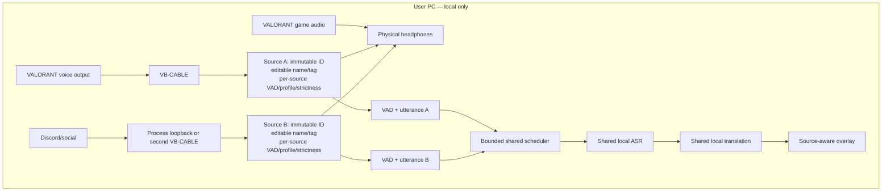

# xTRSNLTR v0.3.0 — Multi-Source Audio, Editable Source Tags, Language Strictness, and VB-CABLE Build Specification

**Target release:** v0.3.0  
**Primary platform:** Windows 11 x64  
**Project:** xTRSNLTR  
**Status entering this milestone:** Beta v0.2.0 with a working Windows end-to-end pipeline  
**Main objective:** Build a generic advanced multi-source translation system that keeps separately routed audio sources independent, lets users name and tag every source, applies language strictness per source, and renders captions such as `[TEAM] Rotate B!` and `[DISCORD] Let's go!`.

---

## 1. Executive Summary

xTRSNLTR v0.2.0 already has:

- Windows audio capture through `audio-core`;
- Silero VAD;
- local Whisper ASR;
- local NLLB or MADLAD translation;
- a Tauri overlay;
- a control application;
- a model manager;
- versioned localhost IPC;
- diagnostics and CI;
- no game-process injection, memory access, automation, or network audio.

v0.3.0 should not try to solve mixed game, announcer, team, and social audio primarily with increasingly complex AI filters. It should separate audio sources before speech recognition and preserve the source identity through the entire pipeline.

VB-CABLE remains a separately installed third-party routing tool. xTRSNLTR does not own, bundle, rename, or silently install it. The application simply supports any compatible Windows audio endpoint or documented process-loopback source. VB-CABLE is the recommended routing option for VALORANT voice because it creates a clean endpoint that xTRSNLTR can capture.

The intended routing is:

```text
VALORANT team/party voice
→ user-installed VB-CABLE endpoint
→ xTRSNLTR source with editable name "VALORANT Team"
→ editable caption tag "TEAM"
→ per-source VAD
→ per-source language profile and strictness
→ shared ASR/translation scheduler
→ [TEAM] Rotate B!

Discord or social voice
→ second user-installed virtual endpoint
  OR Windows process-specific loopback
→ xTRSNLTR source with editable name "Discord Friends"
→ editable caption tag "DISCORD"
→ per-source VAD
→ per-source language profile and strictness
→ shared ASR/translation scheduler
→ [DISCORD] Let's go!

VALORANT game audio, announcer, music, effects
→ physical headphones
→ monitoring only
→ never sent to ASR
```

Every source has three different identities:

1. **Internal source ID** — immutable and used by settings, IPC, queues, metrics, and caption revision logic.
2. **Display name** — user-editable, longer name used in the control application, such as `Discord Friends`.
3. **Caption tag** — user-editable short label shown in the overlay, such as `DISCORD`.

Renaming a source or changing its tag must never change its internal ID or break active settings.

The audio pipelines remain independent through capture, resampling, VAD, utterance segmentation, and job creation. Expensive ASR and translation models remain shared through a bounded priority scheduler so adding another source does not duplicate model VRAM.

Language behavior is configured independently for every source. Each source chooses a language profile and one of three strictness levels:

- **Off:** transcribe without language rejection;
- **Balanced:** prefer selected languages, allow code-switching and tactical English, reject only clearly unrelated speech;
- **Strict:** force the selected language where supported and reject unexpected-language output more aggressively.

Clean routing is still the primary defense. Language strictness is a secondary filter and must not be described as noise cancellation or speaker separation.

## 2. Source Basis and Current Architecture

This specification extends the existing architecture rather than replacing it.

Current project components:

| Existing component          | Current responsibility                            | v0.3.0 extension                                              |
| --------------------------- | ------------------------------------------------- | ------------------------------------------------------------- |
| `apps/desktop`              | Tauri control app and overlay                     | Multi-source setup, source labels, routing wizard             |
| `crates/audio-core`         | WASAPI capture/playback, resampling, ring buffers | Multiple concurrent source pipelines                          |
| `crates/sidecar-supervisor` | Sidecar lifecycle and health                      | Multi-source configuration and recovery                       |
| `crates/ipc-protocol`       | Versioned Rust/Python messages                    | Add `source_id`, source profile, priorities                   |
| `crates/model-manager`      | Catalog and downloads                             | Provider-neutral mirrors and offline packs                    |
| `crates/overlay-core`       | Overlay metrics/state                             | Source-aware caption lanes                                    |
| `crates/diagnostics`        | Shared metrics                                    | Per-source metrics and scheduler metrics                      |
| `services/inference`        | VAD, Whisper, translation, live worker            | Per-source VAD/utterance state and shared inference scheduler |
| `crates/translation-runner` | MADLAD Candle runner                              | Shared translation jobs from multiple sources                 |

The current pipeline sends one selected Windows audio stream through one VAD/ASR/translation path. v0.3.0 turns that into a set of independent source pipelines feeding one shared inference scheduler.

---

## 3. Goals

### 3.1 Primary goals

1. Support at least two independent speech sources.
2. Build a generic source manager that accepts WASAPI endpoints and documented process-loopback targets.
3. Use separately installed VB-CABLE endpoints as the recommended routing method for VALORANT voice.
4. Keep VALORANT game audio and announcer lines outside the ASR path under correct routing.
5. Give every source its own:
   - immutable internal ID;
   - user-editable display name;
   - user-editable caption tag;
   - capture target;
   - monitoring configuration;
   - VAD and utterance state;
   - language profile;
   - language strictness;
   - caption priority and lane;
   - diagnostics.
6. Render independently labeled captions such as:

```text
[TEAM] Rotate B!
[DISCORD] Let's go!
```

7. Share ASR and translation models safely across sources.
8. Add source-priority behavior when multiple streams are active.
9. Add provider-neutral model downloads suitable for users in mainland China.
10. Preserve the existing hard safety boundary.
11. Keep migration from v0.2.0 automatic, reversible, and non-destructive.

### 3.2 Secondary goals

- Support advanced users who install multiple VB-CABLE devices separately.
- Support process-specific loopback for Discord or browser audio when a second cable is unavailable.
- Provide source presets such as `VALORANT Team`, `Discord`, `Party Chat`, `Browser Voice`, and `Custom`.
- Let users choose caption tag format, including brackets, colon, bullet, or hidden label.
- Provide a first-run audio-routing wizard.
- Detect routing mistakes before the user enters a match.
- Keep the overlay readable during simultaneous conversations.
- Let users hide a source from captions while keeping monitoring enabled.

### 3.3 Non-goals

Do not implement these in v0.3.0:

- player identity detection;
- speaker diarization inside a mixed source;
- speech separation;
- target-speaker extraction;
- game memory access;
- DirectX hooks;
- automatic game-state detection;
- automatic tactical advice;
- custom virtual audio driver development;
- bundling or silently installing VB-CABLE;
- cloud ASR or cloud translation.

## 4. Audio Routing Modes

### 4.1 Recommended Mode — One VB-CABLE Plus Process Capture

This mode requires only the standard VB-CABLE package.

```text
Source A: VALORANT team/party voice
VALORANT Voice Chat Output
→ VB-CABLE Input
→ xTRSNLTR captures VB-CABLE Output

Source B: Discord/social voice
Discord process
→ Windows process-specific loopback
→ xTRSNLTR captures that process audio

Game audio
VALORANT Game Output
→ physical headphones
→ not captured
```

Advantages:

- simplest public setup;
- only one virtual cable required;
- keeps VALORANT announcer/game audio outside Source A if VALORANT routes voice correctly;
- Discord does not need a second virtual endpoint;
- no need to distribute additional VB-CABLE packages.

Limitations:

- Discord notifications may appear in the Discord process stream;
- browser process capture may include all audio from the selected browser process tree;
- process capture must be tested on supported Windows builds.

### 4.2 Advanced Mode — Multiple VB-CABLE Endpoints

This mode is for users who separately install additional VB-CABLE devices.

```text
Source A
VALORANT team/party voice
→ CABLE-A Input
→ xTRSNLTR captures CABLE-A Output

Source B
Discord/social voice
→ CABLE-B Input
→ xTRSNLTR captures CABLE-B Output

Source C
Game audio
→ physical headphones
→ not captured
```

xTRSNLTR may detect and support these endpoints, but the application should not assume that additional VB-CABLE packages are available.

The setup UI must say:

```text
Advanced routing requires additional VB-Audio virtual cable devices
installed separately by the user.
```

Do not include additional proprietary driver packages in the repository or release assets unless explicit redistribution permission exists.

### 4.3 Monitoring

Users still need to hear Sources A and B.

```text
VB-CABLE Source A ─┐
VB-CABLE Source B ─┼→ xTRSNLTR monitoring mix → physical headphones
Process Source B ──┘
```

Important rule:

> Mixing is allowed only for headphone monitoring. ASR must receive each source separately.

Bad:

```text
Source A + Source B + game
→ one mixed bus
→ ASR
```

Correct:

```text
Source A → VAD A → ASR scheduler
Source B → VAD B → ASR scheduler

Source A + Source B + game
→ headphones only
```

---

## 5. Multi-Source Domain Model and Editable Source Identity

The source model must separate immutable identity from user-facing labels.

```rust
#[derive(Debug, Clone, Serialize, Deserialize)]
pub struct AudioSourceConfig {
    /// Immutable UUID-like ID generated once when the source is created.
    /// Never derived from the editable name or tag.
    pub id: String,

    /// Longer user-editable name shown in settings.
    /// Example: "Discord Friends".
    pub display_name: String,

    /// Short user-editable tag shown with captions.
    /// Example: "DISCORD".
    pub caption_tag: String,

    /// Controls how the tag is rendered in the overlay.
    pub label_style: CaptionLabelStyle,

    pub enabled: bool,
    pub capture: CaptureTarget,
    pub monitoring: MonitoringConfig,

    pub language_profile_id: String,
    pub language_strictness: LanguageStrictness,

    pub caption_lane: CaptionLane,
    pub priority: u8,
    pub provisional_enabled: bool,
    pub translate_enabled: bool,
}

#[derive(Debug, Clone, Serialize, Deserialize)]
pub enum CaptureTarget {
    WasapiEndpoint {
        endpoint_id: String,
    },
    ProcessLoopback {
        process_match: ProcessMatchRule,
    },
}

#[derive(Debug, Clone, Serialize, Deserialize)]
pub struct MonitoringConfig {
    pub enabled: bool,
    pub output_endpoint_id: Option<String>,
    pub volume: f32,
}

#[derive(Debug, Clone, Serialize, Deserialize)]
pub enum CaptionLane {
    Primary,
    Secondary,
    Hidden,
}

#[derive(Debug, Clone, Serialize, Deserialize)]
pub enum CaptionLabelStyle {
    Brackets, // [TEAM] Rotate B!
    Colon,    // TEAM: Rotate B!
    Bullet,   // TEAM • Rotate B!
    Stacked,  // TEAM on one line, caption below
    Hidden,   // Rotate B!
}
```

### 5.1 Source identity rules

- `id` is generated once and never changes.
- `display_name` is editable at any time.
- `caption_tag` is editable at any time.
- Renaming a source must not recreate its runtime state unless capture settings changed.
- IPC routing, caption revisions, queues, diagnostics, and persistence use `id` only.
- `display_name` and `caption_tag` are presentation metadata.
- Duplicate display names are allowed.
- Duplicate tags are allowed but the UI should show a warning because captions may become confusing.
- Empty caption tag means the label is hidden.

Example:

```json
{
  "id": "src_7f4cbd1a",
  "display_name": "Discord Friends",
  "caption_tag": "DISCORD",
  "label_style": "brackets",
  "capture": {
    "type": "wasapi_endpoint",
    "endpoint_id": "..."
  },
  "language_profile_id": "taglish",
  "language_strictness": "balanced",
  "priority": 60,
  "caption_lane": "secondary"
}
```

Rendered output:

```text
[DISCORD] Let's go!
```

### 5.2 Source editor requirements

Every source editor must expose:

| Field                | Example           |
| -------------------- | ----------------- |
| Source name          | Discord Friends   |
| Caption tag          | DISCORD           |
| Caption label style  | `[TAG] Caption`   |
| Audio capture type   | WASAPI endpoint   |
| Audio input          | CABLE-B Output    |
| Language profile     | Tagalog + English |
| Language strictness  | Balanced          |
| Priority             | Normal            |
| Overlay lane         | Secondary         |
| Monitoring           | Enabled           |
| Monitoring volume    | 80%               |
| Captions             | Enabled           |
| Provisional captions | Disabled          |

The editor must show a live preview:

```text
[DISCORD] Let's rotate after this round.
```

Recommended tag validation:

- trim leading and trailing whitespace;
- no line breaks or control characters;
- Unicode allowed;
- suggested maximum 16 visible characters;
- hard maximum 32 Unicode scalar values;
- empty tag allowed and interpreted as hidden;
- warn, but do not block, duplicate tags;
- sanitize before rendering and never treat tag text as HTML.

Useful tags include:

```text
TEAM
DISCORD
PARTY
FRIENDS
队伍
朋友
TEMAN
SOURCE A
```

### 5.3 Source presets

Presets populate editable defaults but never lock them.

```text
VALORANT Team
Discord
Party Chat
Browser Voice
Custom
```

Example preset:

```yaml
preset: valorant_team
display_name: VALORANT Team
caption_tag: TEAM
label_style: brackets
priority: 100
caption_lane: primary
language_profile_id: auto
language_strictness: balanced
```

### 5.4 Runtime source state

Each active source owns independent capture and speech state.

```rust
pub struct AudioSourceRuntime {
    pub source_id: String,
    pub config: AudioSourceConfig,
    pub capture_state: CaptureState,
    pub ring_buffer: AudioRingBuffer,
    pub resampler: StreamingResampler,
    pub meter: AudioMeter,
    pub sequence_number: u64,
}
```

Python sidecar:

```python
@dataclass
class SourceRuntime:
    source_id: str
    display_name: str
    caption_tag: str
    language_profile_id: str
    language_strictness: str
    priority: int
    vad: VadEngine
    utterance_manager: UtteranceManager
    provisional_state: ProvisionalState
    last_sequence_number: int | None
```

Do not share VAD, utterance state, sequence counters, or provisional-caption state between sources.

## 6. Language Profiles and Per-Source Strictness

The language profile defines what languages and glossaries a source expects. Strictness defines how aggressively that expectation is enforced.

```rust
#[derive(Debug, Clone, Serialize, Deserialize)]
pub struct LanguageProfile {
    pub id: String,
    pub display_name: String,
    pub asr_provider_id: String,
    pub forced_asr_language: Option<String>,
    pub allowed_languages: Vec<String>,
    pub allow_english_terms: bool,
    pub translation_target: String,
    pub glossary_ids: Vec<String>,
    pub minimum_language_confidence: Option<f32>,
}

#[derive(Debug, Clone, Copy, Serialize, Deserialize)]
pub enum LanguageStrictness {
    Off,
    Balanced,
    Strict,
}
```

Strictness belongs to `AudioSourceConfig`, not the global application. Source A may use Taglish Balanced while Source B uses Mandarin Strict.

### 6.1 Strictness behavior

| Behavior                                      |          Off |         Balanced |                                 Strict |
| --------------------------------------------- | -----------: | ---------------: | -------------------------------------: |
| Use selected profile to choose model/glossary |          Yes |              Yes |                                    Yes |
| Force ASR language when provider supports it  |           No | Prefer when safe |                                    Yes |
| Allow code-switching languages in profile     |          Yes |              Yes |          Only when profile allows them |
| Reject clearly unrelated languages            |           No |              Yes |                                    Yes |
| Reject uncertain short speech                 |           No |       Usually no | Only above configured minimum duration |
| Allow tactical glossary bypass                |          Yes |              Yes |                                    Yes |
| Raise minimum display confidence              |           No |         Moderate |                                   High |
| Translate already-English text                | Usually skip |             Skip |      Skip unless explicitly configured |

#### Off

Use when the conversation language is unknown or highly mixed.

```text
ASR processes any speech.
No output is rejected solely because of language.
```

#### Balanced — default

Use for ordinary Taglish, Bislish, Chinese-English, and gaming speech.

```text
Prefer selected languages.
Allow English tactical terms.
Reject clearly unrelated full utterances.
Do not reject short callouts only because language ID is uncertain.
```

#### Strict

Use when one source should contain one known language.

```text
Force language when supported.
Require output to match allowed languages.
Use a higher confidence threshold.
Reject clearly unexpected utterances before translation and overlay.
```

Strict mode must not claim to remove acoustic noise. It filters language interpretation after VAD and, where supported, conditions the ASR decoder.

### 6.2 Initial profiles

```yaml
profiles:
  tagalog:
    display_name: Tagalog
    forced_asr_language: fil
    allowed_languages: [fil]
    allow_english_terms: true
    translation_target: en
    glossary_ids: [valorant-core, tagalog-gaming]
    recommended_strictness: strict

  taglish:
    display_name: Tagalog + English
    forced_asr_language: null
    allowed_languages: [fil, en]
    allow_english_terms: true
    translation_target: en
    glossary_ids: [valorant-core, taglish-gaming]
    recommended_strictness: balanced

  cebuano:
    display_name: Cebuano
    forced_asr_language: ceb
    allowed_languages: [ceb]
    allow_english_terms: true
    translation_target: en
    glossary_ids: [valorant-core, cebuano-gaming]
    recommended_strictness: strict

  bislish:
    display_name: Cebuano + English
    forced_asr_language: null
    allowed_languages: [ceb, en]
    allow_english_terms: true
    translation_target: en
    glossary_ids: [valorant-core, bislish-gaming]
    recommended_strictness: balanced

  mandarin:
    display_name: Mandarin Chinese
    forced_asr_language: zh
    allowed_languages: [zh]
    allow_english_terms: false
    translation_target: en
    glossary_ids: [valorant-core, chinese-gaming]
    recommended_strictness: strict

  chinese_english:
    display_name: Chinese + English
    forced_asr_language: null
    allowed_languages: [zh, en]
    allow_english_terms: true
    translation_target: en
    glossary_ids: [valorant-core, chinese-english-gaming]
    recommended_strictness: balanced

  auto:
    display_name: Auto
    forced_asr_language: null
    allowed_languages: [fil, ceb, zh, en]
    allow_english_terms: true
    translation_target: en
    glossary_ids: [valorant-core]
    recommended_strictness: off
```

### 6.3 Processing order

```text
Separated source audio
→ per-source VAD
→ selected profile
→ ASR with forced or preferred language when supported
→ language validation according to strictness
→ tactical glossary and short-callout bypass
→ translation
→ source-aware caption
```

Example:

```text
CABLE-A
→ display name: VALORANT Team
→ tag: TEAM
→ Taglish Balanced
→ [TEAM] Two enemies at B main.

CABLE-B
→ display name: Discord Friends
→ tag: DISCORD
→ Cebuano Balanced
→ [DISCORD] I will watch the flank.
```

### 6.4 Short callouts

Language identification is unreliable on very short utterances:

```text
B
left
two
go
mid
```

Apply a tactical bypass before strict language rejection.

```python
if normalized_text in tactical_short_terms:
    allow_caption(reason="tactical_glossary")
elif utterance_duration_ms < short_utterance_threshold_ms:
    apply_short_utterance_policy(profile, strictness)
elif strictness == "strict" and detected_language not in profile.allowed_languages:
    reject_caption(reason="unexpected_language")
```

Strict mode should require a minimum speech duration before rejecting solely from language ID. This prevents valid one-word callouts from disappearing.

### 6.5 Provider capability differences

The UI must distinguish:

- **Forced:** the selected provider actually conditions/locks ASR language;
- **Preferred:** profile influences model selection or prompt but does not guarantee decoding language;
- **Post-filtered:** the runtime cannot force language, so xTRSNLTR validates the result after ASR.

Never label a mode “strict language decoding” if the active provider only supports post-filtering.

## 7. Shared Inference Scheduler

Multiple source pipelines must not load duplicate ASR and translation models by default.

```text
Source A utterance ─┐
Source B utterance ─┼→ shared scheduler → ASR provider → translation provider
Source N utterance ─┘
```

### 7.1 Job model

```python
@dataclass(order=True)
class InferenceJob:
    sort_key: tuple[int, int, int]
    source_id: str
    utterance_id: str
    revision: int
    priority: int
    is_final: bool
    created_monotonic_ns: int
    language_profile_id: str
    audio: np.ndarray
```

### 7.2 Priority rules

1. Final VALORANT team utterance.
2. Final Discord/friend utterance.
3. Final browser/social utterance.
4. Provisional VALORANT utterance.
5. Provisional Discord utterance.
6. Provisional browser/social utterance.

Within one priority:

- oldest final job first;
- newest provisional revision replaces older provisional jobs;
- keep at most one queued provisional job per source/utterance.

### 7.3 Scheduler constraints

- ASR concurrency: 1 by default.
- Translation concurrency: 1 by default.
- Bounded utterance and translation queues.
- Stale provisional cancellation.
- Final jobs cannot be dropped silently.
- Queue delay is measured separately from inference time.
- On overload:
  1. drop stale provisional jobs;
  2. pause secondary provisional decoding;
  3. keep final jobs;
  4. expose a warning.

### 7.4 Simultaneous source policy

```typescript
type SimultaneousCaptionPolicy =
  "show_both" | "prioritize_team" | "team_only_when_simultaneous";
```

Default:

```yaml
simultaneous_caption_policy: prioritize_team
```

---

## 8. IPC Protocol v2

Increment the IPC protocol version and attach immutable source identity plus a snapshot of user-facing metadata to every relevant event.

### 8.1 Audio frame metadata

Audio routing uses `source_id`. Editable names and tags are not required on every binary frame after source configuration has been acknowledged.

```json
{
  "protocol_version": 2,
  "session_id": "uuid",
  "source_id": "src_7f4cbd1a",
  "sequence_number": 1234,
  "capture_monotonic_ns": 123456789,
  "sample_rate": 16000,
  "channels": 1,
  "sample_format": "f32le"
}
```

### 8.2 Source configuration message

```json
{
  "type": "sources.configure",
  "payload": {
    "sources": [
      {
        "source_id": "src_7f4cbd1a",
        "display_name": "VALORANT Team",
        "caption_tag": "TEAM",
        "label_style": "brackets",
        "language_profile_id": "taglish",
        "language_strictness": "balanced",
        "priority": 100,
        "caption_lane": "primary"
      }
    ]
  }
}
```

### 8.3 Caption messages

Every caption includes a presentation snapshot so an already-created caption remains visually stable even if the user renames the source immediately afterward.

```json
{
  "type": "caption.final",
  "payload": {
    "source_id": "src_7f4cbd1a",
    "source_display_name": "VALORANT Team",
    "source_tag": "TEAM",
    "source_label_style": "brackets",
    "caption_lane": "primary",

    "utterance_id": "uuid",
    "caption_id": "uuid",
    "revision": 4,

    "language_profile_id": "taglish",
    "language_strictness": "balanced",
    "detected_language": "fil",
    "language_filter_result": "accepted",

    "source_text": "dalawa sa b main",
    "english_text": "two at B main",
    "is_final": true,
    "capture_to_caption_ms": 1120.3
  }
}
```

Caption identity is based on:

```text
source_id + utterance_id + revision
```

Never use editable names or tags as keys.

### 8.4 Source metadata updates

Renaming a source should not restart capture or inference.

```text
source.presentation.update
```

Payload:

```json
{
  "source_id": "src_7f4cbd1a",
  "display_name": "Ranked Team",
  "caption_tag": "TEAM",
  "label_style": "brackets"
}
```

Capture-related changes use a different command and may require source restart.

### 8.5 Control messages

Desktop to sidecar:

```text
sources.configure
source.start
source.stop
source.flush
source.presentation.update
source.language_profile.update
source.language_strictness.update
scheduler.policy.update
```

Sidecar to desktop:

```text
source.health
source.vad_state
source.queue_state
source.caption
source.language_filtered
scheduler.metrics
scheduler.overloaded
```

## 9. Source-Aware Overlay and Editable Tags

The current single fixed-size caption card becomes source-aware and renders the user-defined caption tag.

### 9.1 Expected output

```text
[TEAM] Rotate B!
[DISCORD] Let's go!
```

Alternative styles:

```text
TEAM: Rotate B!
DISCORD: Let's go!
```

```text
TEAM • Rotate B!
DISCORD • Let's go!
```

```text
TEAM
Rotate B!

DISCORD
Let's go!
```

The label can also be hidden:

```text
Rotate B!
Let's go!
```

### 9.2 Rendering rules

- Render from `source_id` plus the presentation snapshot in the caption event.
- Never use `caption_tag` as a state key.
- Maximum two active lanes by default.
- Maximum one provisional caption per source.
- Final captions are not replaced by another source.
- Long captions shrink within lane limits.
- Source name and tag edits affect new captions immediately.
- Existing final captions may retain their original snapshot until expiration.
- Source colors are optional and must meet contrast requirements.
- A source may be hidden from the overlay while remaining audible and processed.
- Empty tag or `Hidden` label style renders only the caption text.
- Escape all user-provided name/tag text.

### 9.3 Visual hierarchy

- primary lane: larger and brighter;
- secondary lane: smaller and dimmer;
- provisional caption: reduced opacity;
- final caption: full opacity;
- tag: stable width where practical to reduce layout jitter;
- editable source name appears in control UI, not necessarily in compact overlay.

### 9.4 Simultaneous policies

```typescript
type SimultaneousCaptionPolicy =
  "show_both" | "prioritize_primary" | "primary_only_when_simultaneous";
```

Source priority and lane—not the editable tag—control scheduling and visibility.

### 9.5 Presets

Competitive:

```yaml
sources:
  - display_name: VALORANT Team
    caption_tag: TEAM
    label_style: brackets
    lane: primary
    priority: 100
    provisional: true
  - display_name: Discord Friends
    caption_tag: DISCORD
    label_style: brackets
    lane: secondary
    priority: 60
    provisional: false
simultaneous_policy: prioritize_primary
```

Social:

```yaml
sources:
  - display_name: VALORANT Team
    caption_tag: TEAM
    lane: primary
  - display_name: Discord Friends
    caption_tag: DISCORD
    lane: secondary
simultaneous_policy: show_both
```

Presets populate defaults only. All source names, tags, styles, lanes, and priorities remain editable.

## 10. Audio Source and VB-CABLE Setup Wizard

The wizard creates generic source configurations. VB-CABLE is detected as one possible endpoint provider and remains separately installed.

### Step 1 — Choose setup type

```text
Recommended
One separately installed VB-CABLE for VALORANT voice
+ process capture for Discord

Advanced
Multiple separately installed virtual audio endpoints
or process captures for separate applications
```

### Step 2 — Add the first source

Preset choices:

```text
VALORANT Team
Discord
Party Chat
Browser Voice
Custom
```

After choosing a preset, let the user edit:

```text
Source name: VALORANT Team
Caption tag: TEAM
Caption style: [TEAM] Caption
```

Show live preview:

```text
[TEAM] Rotate B!
```

### Step 3 — Select capture method

Choose:

- Windows audio endpoint;
- process-specific loopback when supported.

Show endpoint name, stable ID, direction, state, sample rate, and channel count. Do not silently select when multiple matches exist.

### Step 4 — Configure VALORANT routing

```text
VALORANT game output:
Physical headphones

VALORANT voice chat output:
VB-CABLE Input
```

The setup guide must explain that VB-CABLE is installed separately from its official source.

### Step 5 — Add Discord or social source

Recommended:

```text
Source name: Discord Friends
Caption tag: DISCORD
Capture: Discord process loopback
```

Advanced:

```text
Source name: Discord Friends
Caption tag: DISCORD
Capture: CABLE-B Output
```

Preview:

```text
[DISCORD] Let's go!
```

### Step 6 — Select monitoring output

Warn about:

- capture/monitor feedback loops;
- disconnected endpoints;
- microphones selected as playback;
- Bluetooth hands-free mode;
- duplicate monitoring routes.

### Step 7 — Source isolation test

For TEAM:

1. play voice into the selected cable;
2. confirm TEAM meter moves;
3. trigger VALORANT game/announcer audio;
4. confirm TEAM meter remains silent or near silent.

For DISCORD:

1. play Discord voice;
2. confirm DISCORD meter moves;
3. confirm TEAM meter does not move.

### Step 8 — Monitoring test

Verify all enabled voice sources are audible without feedback. Allow per-source monitoring volume adjustment.

### Step 9 — Select language profile and strictness per source

Example:

```text
TEAM
Profile: Taglish
Strictness: Balanced

DISCORD
Profile: Cebuano + English
Strictness: Balanced
```

Explain the levels inline:

```text
Off — process any language
Balanced — prefer selected languages; recommended for mixed gaming speech
Strict — reject unexpected languages more aggressively
```

### Step 10 — Overlay preview

Show both sample captions simultaneously:

```text
[TEAM] Rotate B!
[DISCORD] Let's go!
```

Allow editing source tags and label styles directly from the preview.

### Step 11 — Save preset

Suggested names:

```text
VALORANT + Discord
VALORANT only
Custom
```

## 11. Model Selection Strategy

### 11.1 Initial recommendations

| Language profile  | ASR default                                       | Translation default |
| ----------------- | ------------------------------------------------- | ------------------- |
| Tagalog           | Whisper large-v3-turbo                            | MADLAD              |
| Taglish           | Whisper large-v3-turbo                            | MADLAD              |
| Cebuano           | Omnilingual CTC 300M int8                         | MADLAD              |
| Bislish           | Omnilingual CTC 300M int8                         | MADLAD              |
| Mandarin          | Whisper large-v3-turbo or dedicated Chinese model | MADLAD              |
| Chinese + English | Whisper large-v3-turbo                            | MADLAD              |
| Auto              | Whisper large-v3-turbo                            | MADLAD              |

### 11.2 Capability manifest

```json
{
  "id": "omni-ctc-300m-int8",
  "kind": "asr",
  "capabilities": {
    "languages": ["ceb", "fil", "en", "zh"],
    "supports_forced_language": false,
    "supports_streaming": false,
    "supports_provisional_redecode": true
  },
  "recommended_profiles": ["cebuano", "bislish"],
  "license": {
    "spdx": "Apache-2.0"
  }
}
```

Show license, commercial restrictions, source, size, expected disk/VRAM, runtime, and supported profiles.

---

## 12. Mainland China Model Distribution

Keep `HF_ENDPOINT` support, but make the catalog provider-neutral.

### 12.1 Catalog structure

```json
{
  "id": "omni-ctc-300m-int8",
  "version": "1",
  "license": "Apache-2.0",
  "artifacts": [
    {
      "path": "model.int8.onnx",
      "size": 123456789,
      "sha256": "canonical-sha256"
    }
  ],
  "providers": [
    {
      "id": "project-global",
      "region": "global",
      "urls": {
        "model.int8.onnx": "https://global-cdn.example/..."
      }
    },
    {
      "id": "huggingface",
      "region": "global",
      "urls": {
        "model.int8.onnx": "https://huggingface.co/..."
      }
    },
    {
      "id": "modelscope",
      "region": "mainland-cn",
      "urls": {
        "model.int8.onnx": "https://modelscope.cn/..."
      }
    },
    {
      "id": "project-cn",
      "region": "mainland-cn",
      "urls": {
        "model.int8.onnx": "https://cn-cdn.example/..."
      }
    }
  ]
}
```

Every provider must deliver identical checksum-verified artifacts.

### 12.2 Download UI

```text
Automatic
Global
Mainland China
Custom Hugging Face-compatible endpoint
Offline model pack
```

### 12.3 Offline packs

Use:

```text
*.xtrs-modelpack
```

Contents:

```text
manifest.json
manifest.sig
LICENSE.txt
NOTICE.txt
artifacts/
checksums.sha256
```

Import must verify signature, checksums, compatibility, and install atomically.

---

## 13. Settings Migration

Map the existing v0.2 configuration into one generic source with editable presentation metadata.

```text
existing capture endpoint
→ source capture target

existing source mode
→ source.language_profile_id

existing monitoring output
→ source.monitoring.output_endpoint_id

existing overlay settings
→ primary lane
```

Generated defaults:

```json
{
  "schema_version": 3,
  "sources": [
    {
      "id": "generated-stable-uuid",
      "display_name": "VALORANT Team",
      "caption_tag": "TEAM",
      "label_style": "brackets",
      "enabled": true,
      "capture": {
        "type": "wasapi_endpoint",
        "endpoint_id": "existing-endpoint-id"
      },
      "language_profile_id": "auto",
      "language_strictness": "balanced",
      "priority": 100,
      "caption_lane": "primary"
    }
  ]
}
```

Requirements:

- back up v0.2 settings;
- migration is idempotent;
- generate the source ID once and persist it;
- unavailable endpoint IDs remain visible;
- no silent endpoint switching;
- user may edit the generated name and tag immediately;
- renaming does not change the generated ID;
- routing can be reset without deleting models;
- rolling back to v0.2 must not overwrite the backup.

## 14. Diagnostics

### 14.1 Per-source metrics

```text
source.capture_active
source.frames_received
source.frames_dropped
source.audio_level_rms
source.audio_level_peak
source.vad_active
source.utterance_count
source.provisional_count
source.final_count
source.asr_errors
source.translation_errors
source.queue_wait_ms
source.capture_to_caption_ms
```

### 14.2 Scheduler metrics

```text
scheduler.asr_queue_depth
scheduler.translation_queue_depth
scheduler.provisional_dropped
scheduler.provisional_coalesced
scheduler.final_wait_ms
scheduler.overload_events
scheduler.active_source
```

### 14.3 New errors

```text
SOURCE_CONFIG_INVALID
SOURCE_ENDPOINT_NOT_FOUND
SOURCE_PROCESS_NOT_FOUND
SOURCE_CAPTURE_FAILED
SOURCE_MONITOR_FAILED
SOURCE_FEEDBACK_SUSPECTED
SOURCE_SEQUENCE_GAP
SOURCE_QUEUE_OVERLOADED
LANGUAGE_PROFILE_UNSUPPORTED
MODEL_PROFILE_INCOMPATIBLE
MODEL_PROVIDER_UNAVAILABLE
MODEL_PACK_SIGNATURE_INVALID
```

---

## 15. Security and Privacy

Existing boundaries remain unchanged.

The application must never inject into VALORANT, hook graphics APIs, read game memory, inspect packets, automate input, modify game files, bypass anti-cheat, or send audio to a remote service.

Additional requirements:

- process loopback uses documented Windows APIs only;
- model-provider URLs come from a signed catalog or explicit user input;
- offline packs require signature and checksum verification;
- source display names and caption tags are persisted as user settings, while transcript content is not persisted by default;
- diagnostics never start recording automatically.

---

## 16. Installer and VB-CABLE Behavior

Recommended installer behavior:

1. Install xTRSNLTR.
2. Install the local inference runtime.
3. Do not bundle models.
4. Do not silently install VB-CABLE.
5. Detect whether VB-CABLE exists.
6. If missing, show why it is needed and provide an official installation handoff.
7. Allow users to continue without it for process/mic testing.
8. Resume setup after restart.
9. Do not remove VB-CABLE when xTRSNLTR is uninstalled.

The app may support additional user-installed VB-CABLE endpoints.

Add:

```text
THIRD_PARTY_NOTICES.md
docs/VB_CABLE_SETUP.md
```

---

## 17. Detailed Build Phases

### Phase 0 — Preparation

- Add ADRs for multi-source audio, separately installed VB-CABLE routing, editable source identity, per-source strictness, shared scheduling, and provider-neutral catalogs.
- Freeze protocol v2.
- Add `multi_source_audio` feature flag.
- Keep v0.2 behavior when disabled.

**Acceptance:** source identity rules, strictness behavior, schemas, and migration are reviewed before implementation.

### Phase 1 — Source Configuration, Editable Names/Tags, and Migration

- Add immutable `source_id` generation.
- Add editable `display_name` and `caption_tag`.
- Add label styles: brackets, colon, bullet, stacked, hidden.
- Add source presets.
- Add language profile and strictness fields.
- Add priorities and lanes.
- Add schema v3 and v0.2 migration.
- Validate duplicate endpoints, unsafe loops, tag length, control characters, and profile/model compatibility.
- Add live caption preview to the source editor.

**Acceptance:** existing installations open with one migrated source that renders `[TEAM] Example caption`, and changing its name/tag does not change its internal ID.

### Phase 2 — IPC v2

- Add `source_id` to binary audio headers.
- Add source presentation snapshot to captions.
- Add language strictness and filter result fields.
- Add `source.presentation.update` without restarting capture.
- Add v1/v2 negotiation.
- Add multi-source fake sidecar.

**Acceptance:** fake TEAM and DISCORD sources create independent captions, and renaming DISCORD does not affect TEAM revisions.

### Phase 3 — Multiple Audio Pipelines

- Refactor `audio-core` to a generic source registry.
- Add concurrent endpoint/process captures.
- Add per-source buffers, resamplers, meters, sequence counters, and monitoring.
- Isolate source failures.
- Do not hard-code source logic to specific tags such as TEAM or DISCORD.

**Acceptance:** two arbitrarily named sources run simultaneously without cross-contamination.

### Phase 4 — VB-CABLE and Source Setup Wizard

- Detect separately installed VB-CABLE endpoints.
- Add recommended and advanced setup modes.
- Add source presets, editable names/tags, label-style preview, and capture selection.
- Add VALORANT and Discord routing instructions.
- Add isolation and monitoring tests.
- Add language profile and strictness selection.
- Save reusable presets.

**Acceptance:** setup requires no manual config-file editing, and the wizard never implies that VB-CABLE is bundled with xTRSNLTR.

### Phase 5 — Per-Source VAD

- Maintain VAD and utterance state per immutable source ID.
- Add source-specific start, stop, flush, and diagnostics.
- Ensure presentation edits do not reset VAD.
- Ensure source restart clears only its own speech state.

**Acceptance:** simultaneous source speech produces independent utterances and tag changes do not interrupt capture.

### Phase 6 — Shared Scheduler

- Add bounded ASR and translation queues.
- Add source priorities and stale provisional coalescing.
- Preserve final jobs.
- Add overload handling and metrics.
- Keep scheduling independent from editable source names/tags.

**Acceptance:** model VRAM is shared rather than duplicated, and changing a tag never changes priority.

### Phase 7 — Language Profiles and Strictness

- Add profile catalog.
- Bind profile and Off/Balanced/Strict level per source.
- Pass forced language where supported.
- Distinguish forced, preferred, and post-filtered provider behavior.
- Add allowed-language gate, tactical bypass, glossaries, English skip logic, and filter diagnostics.
- Add minimum-duration protection for short callouts.

**Acceptance:** strictness changes real processing behavior, and the UI does not falsely claim decoder locking for providers that only support post-filtering.

### Phase 8 — Source-Aware Overlay

- Add primary and secondary lanes.
- Render editable caption tags.
- Add all label styles.
- Add simultaneous policies, presets, per-source expiration, and hide-source options.
- Escape user-provided labels.
- Preserve immutable source ID as the state key.

**Acceptance:** the overlay renders `[TEAM] Rotate B!` and `[DISCORD] Let's go!` independently, and Source B cannot overwrite Source A.

### Phase 9 — Model Manager v2

- Add model capabilities and recommended profiles.
- Add provider lists, probing, failover, ModelScope/mainland-China provider support, signed catalogs, and offline packs.
- Preserve custom `HF_ENDPOINT`.

**Acceptance:** Hugging Face availability is not required.

### Phase 10 — Diagnostics

- Add source health using display names/tags for presentation and internal IDs for correlation.
- Add per-source meters, queue metrics, language filter metrics, leakage test, and content-free support data.
- Do not log transcript content by default.

**Acceptance:** users can diagnose wrong routing, unavailable process, unsupported strictness/provider behavior, missing model, overload, and monitoring failures.

### Phase 11 — Real-World Validation

Test:

- one and multiple separately installed VB-CABLE endpoints;
- Discord process and endpoint capture;
- arbitrary source names and Unicode tags;
- renaming while active;
- hidden tags and all label styles;
- device reconnect;
- simultaneous sources;
- every language profile at Off, Balanced, and Strict where meaningful;
- short tactical callouts;
- VALORANT announcer/game sound isolation;
- performance with one and two sources.

**Acceptance:** correctly routed game audio is absent from TEAM ASR, labels remain source-correct, and strictness does not incorrectly discard the agreed short-callout test set beyond the benchmark threshold.

### Phase 12 — Installer and Documentation

Add:

```text
docs/17_MULTI_SOURCE_AUDIO.md
docs/18_VB_CABLE_SETUP.md
docs/19_SOURCE_NAMES_TAGS_AND_OVERLAY.md
docs/20_LANGUAGE_PROFILES_AND_STRICTNESS.md
docs/21_MODEL_PROVIDERS_AND_OFFLINE_PACKS.md
docs/22_V0_3_MIGRATION.md
docs/23_V0_3_VALIDATION.md
```

**Acceptance:** a clean Windows user can install xTRSNLTR, install/configure VB-CABLE separately, create and label multiple sources, set strictness per source, select a model provider, and finish setup.

## 18. Suggested Workspace Changes

```text
apps/desktop/src/features/
├── sources/
│   ├── SourceList.tsx
│   ├── SourceEditor.tsx
│   ├── SourceIdentityFields.tsx
│   ├── SourceCapturePicker.tsx
│   ├── SourceLanguageSettings.tsx
│   ├── CaptionTagPreview.tsx
│   └── RoutingWizard.tsx
├── language-profiles/
│   ├── ProfilePicker.tsx
│   └── StrictnessPicker.tsx
├── model-providers/
└── overlay-presets/

crates/audio-core/src/
├── source_manager.rs
├── source_runtime.rs
├── source_identity.rs
├── capture_target.rs
├── process_loopback.rs
├── monitoring_mixer.rs
└── source_diagnostics.rs

crates/ipc-protocol/src/
├── v1/
├── v2/
│   ├── audio.rs
│   ├── captions.rs
│   ├── source_identity.rs
│   ├── sources.rs
│   ├── language.rs
│   └── scheduler.rs
└── negotiation.rs

crates/model-manager/src/
├── provider.rs
├── signed_catalog.rs
├── offline_pack.rs
├── capabilities.rs
└── region.rs

services/inference/
├── sources/
│   ├── registry.py
│   ├── runtime.py
│   └── utterances.py
├── scheduler/
├── profiles/
│   ├── catalog.py
│   ├── strictness.py
│   ├── language_gate.py
│   └── glossary.py
└── providers/
```

## 19. Acceptance Checklist

### Source configuration and identity

- [ ] v0.2 settings migrate.
- [ ] Every source has an immutable internal ID.
- [ ] Users can edit source display name.
- [ ] Users can edit caption tag.
- [ ] Renaming does not change internal ID.
- [ ] Empty tag hides the label.
- [ ] Unicode tags render safely.
- [ ] Control characters and line breaks are rejected.
- [ ] Duplicate tags produce a warning.
- [ ] All label styles have preview and tests.
- [ ] Missing endpoints remain visible.
- [ ] Unsafe monitoring loops are blocked.
- [ ] Profile/model compatibility is validated.

### Audio

- [ ] Two sources capture simultaneously.
- [ ] Sources may be arbitrary endpoints or documented process captures.
- [ ] VB-CABLE is treated as separately installed.
- [ ] Buffers, resamplers, and sequence numbers are independent.
- [ ] Monitoring does not alter ASR streams.
- [ ] Source failure is isolated.
- [ ] Buffers remain bounded.

### Sidecar and scheduler

- [ ] Per-source VAD and utterances.
- [ ] Shared ASR and translation models.
- [ ] Priority scheduling uses source configuration, not tag text.
- [ ] Stale provisional cancellation.
- [ ] Final jobs preserved.
- [ ] Presentation edits do not restart inference.

### Language profiles and strictness

- [ ] Strictness is configurable per source.
- [ ] Off mode performs no language-only rejection.
- [ ] Balanced mode permits configured code-switching and tactical English.
- [ ] Strict mode forces language where the provider supports it.
- [ ] Post-filter-only providers are identified honestly.
- [ ] Unexpected-language decisions are observable in diagnostics.
- [ ] Short tactical callouts have a tested bypass policy.
- [ ] English-only captions can skip translation.

### Overlay

- [ ] `[TEAM] Rotate B!` and `[DISCORD] Let's go!` render independently.
- [ ] Source labels and two lanes.
- [ ] No cross-source overwrite.
- [ ] Simultaneous policy works.
- [ ] Hidden labels work.
- [ ] User-provided labels are escaped.
- [ ] Overlay never steals focus.

### Model manager

- [ ] Provider probing and failover.
- [ ] Custom HF endpoint retained.
- [ ] Mainland-China provider supported.
- [ ] Offline pack import.
- [ ] Signature and SHA-256 verification.
- [ ] Atomic install and rollback.

### Installer and third-party routing

- [ ] xTRSNLTR installer does not bundle VB-CABLE by default.
- [ ] Missing VB-CABLE produces an official installation handoff.
- [ ] Setup resumes after restart.
- [ ] App supports additional user-installed endpoints.
- [ ] Uninstall does not remove VB-CABLE.

### Safety

- [ ] No game injection, hooks, memory reads, packet inspection, or input automation.
- [ ] No network audio.
- [ ] No default content persistence.

## 20. Release Criteria

v0.3.0 is releasable when:

1. v0.2 settings migrate successfully.
2. Two arbitrary sources run simultaneously.
3. Each source has an immutable ID and editable display name/tag.
4. The overlay correctly renders at least:

```text
[TEAM] Rotate B!
[DISCORD] Let's go!
```

5. Renaming or retagging an active source does not restart capture or corrupt caption revisions.
6. VALORANT voice routes through a separately installed VB-CABLE endpoint.
7. Game audio remains outside ASR under the documented routing setup.
8. Discord uses process capture or a user-installed second endpoint.
9. Per-source VAD and utterance state are stable.
10. Shared inference does not duplicate model VRAM.
11. Source captions do not overwrite each other.
12. Off, Balanced, and Strict language behavior is implemented per source.
13. Short tactical callouts pass the defined regression set.
14. The UI accurately reports whether language behavior is forced, preferred, or post-filtered.
15. Model downloads do not rely exclusively on Hugging Face.
16. Offline model packs work.
17. The installer does not silently bundle or install VB-CABLE.
18. Security and privacy boundaries remain intact.
19. Real VALORANT validation is documented.
20. Rust, TypeScript, and Python checks remain green.

## 21. Codex Master Prompt

```text
Read AGENTS.md, README.md, the current PRD and architecture documents, and
NEXT_BUILD_V0_3_MULTI_SOURCE_VB_CABLE.md.

Implement xTRSNLTR v0.3.0 using the phases in this build specification.

Core product model:
- xTRSNLTR is a generic advanced multi-source translator;
- VB-CABLE is installed separately and is only one supported routing method;
- every source has an immutable internal source ID;
- every source has a user-editable display name and caption tag;
- captions must support examples such as [TEAM] Rotate B! and
  [DISCORD] Let's go!;
- source names and tags are presentation metadata and must never be used as
  queue, IPC, persistence, or revision keys;
- every source independently selects a language profile and Off, Balanced, or
  Strict behavior.

Engineering constraints:
- preserve the existing hard safety boundary;
- use ordinary documented Windows audio APIs only;
- do not combine sources before VAD/ASR;
- keep one VAD and utterance manager per immutable source ID;
- share ASR and translation models through a bounded priority scheduler;
- source priority must not depend on editable labels;
- presentation edits must not restart audio capture;
- do not bundle or silently install VB-CABLE;
- keep model downloads provider-neutral and checksum-verified;
- preserve v0.2 behavior through migration and feature flags;
- keep CI independent of real audio hardware and large model downloads.

Language constraints:
- Off performs no language-only rejection;
- Balanced is the default for code-switched gaming speech;
- Strict forces language only where the provider truly supports it and
  otherwise uses an explicitly identified post-ASR gate;
- short tactical callouts need a tested bypass policy;
- never describe language strictness as acoustic noise removal.

For each phase:
1. restate acceptance criteria;
2. implement the smallest complete vertical slice;
3. add unit and integration tests;
4. run formatting, linting, type checking, and tests;
5. update documentation;
6. report changed files, commands, evidence, and remaining risks.

Do not mark a phase complete from compilation alone.
```

## 22. Final Architecture



The central design rule is:

> Separate audio sources before ASR, preserve immutable source identity through the pipeline, let users freely edit presentation names and tags, enforce language behavior per source, and share expensive models only at the bounded inference scheduler.
