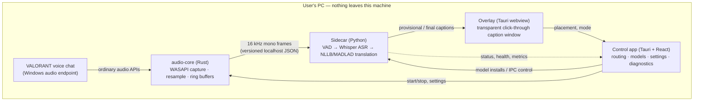
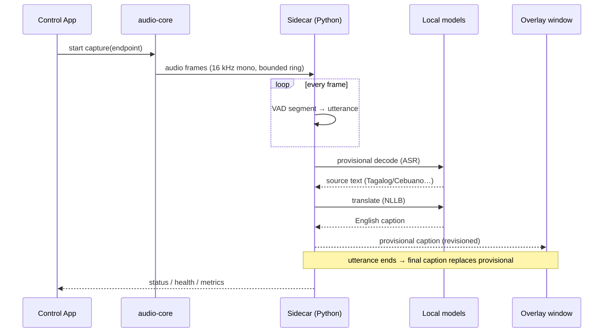
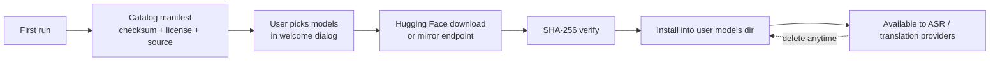
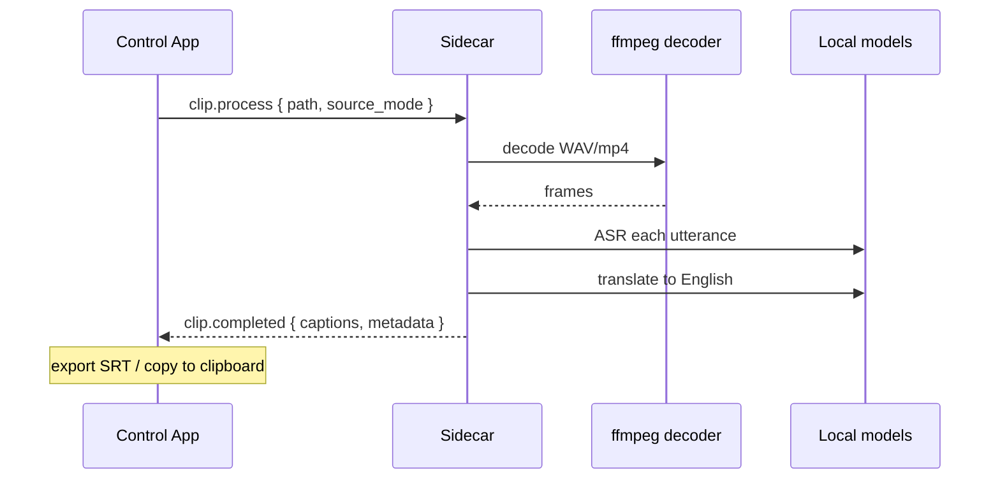

# xTRSNLTR — Project Overview

A fully local Windows companion that translates incoming VALORANT voice chat
(Tagalog / Filipino, Cebuano, Chinese, English) into on-screen English subtitles.

**Status: beta (v0.2.0).** End-to-end pipeline works on Windows; macOS builds
and runs in dev mode but the live audio path needs a port
([docs/16_MACOS_PORT.md](docs/16_MACOS_PORT.md)). All checks (Rust, TypeScript,
Python) are green in CI on every commit.

**Hard safety boundary:** the app never injects into, reads memory of,
automates, or modifies the game, and never touches a network for audio. It
only captures ordinary Windows audio endpoints, processes locally, and draws a
transparent overlay.

---

## 1. What it does

1. Captures the VALORANT voice-chat mix from a Windows audio endpoint
   (virtual audio cable, or the loopback/mic stream you choose).
2. Segments speech with a Silero VAD.
3. Recognizes speech with a local Whisper model.
4. Translates into English with a local translation model (NLLB, or
   MADLAD via a Rust runner).
5. Shows subtitles in a transparent, click-through overlay window — plus a
   full control app for audio routing, models, hotkeys, and diagnostics.

Everything runs on the user's machine. Audio never leaves the PC. No
telemetry, no accounts, no game-process access.

---

## 2. System diagram

### Process model

| Process                | Technology                                             | Responsibility                                                                           |
| ---------------------- | ------------------------------------------------------ | ---------------------------------------------------------------------------------------- |
| **Desktop**            | Tauri 2 + React + TypeScript (strict)                  | Window, routing UI, model manager, settings, hotkeys, overlay window, sidecar supervisor |
| **Sidecar**            | Python 3.11 (faster-whisper, onnxruntime, sherpa-onnx) | VAD, ASR, translation, live worker, clip lab, health                                     |
| **Overlay**            | Same Tauri webview, second window                      | Transparent caption window (click-through, draggable in edit mode)                       |
| **translation-runner** | Rust (candle)                                          | MADLAD-400 3B translation on CPU                                                         |
| **Model manager**      | Rust crate                                             | Catalog, checksum-verified downloads, installs, deletion                                 |

### Workspace layout

| Path                        | What it holds                                              |
| --------------------------- | ---------------------------------------------------------- |
| `apps/desktop`              | React + Vite control app, `src-tauri` (Rust) host          |
| `crates/audio-core`         | WASAPI capture/playback, endpoint catalog, routing, meters |
| `crates/sidecar-supervisor` | Sidecar spawn/lifecycle, protocol envelopes, health        |
| `crates/ipc-protocol`       | Versioned IPC message types (Rust ↔ Python)                |
| `crates/model-manager`      | Model catalog, Hugging Face downloads, checksums, installs |
| `crates/overlay-core`       | Overlay metrics snapshot (shared with audio-core)          |
| `crates/diagnostics`        | Metrics snapshot types shared by the workspace             |
| `crates/translation-runner` | MADLAD candle inference binary                             |
| `services/inference`        | Python sidecar package + tests                             |
| `models/`                   | Catalog manifest + (gitignored) downloaded artifacts       |
| `scripts/`                  | Model install, sidecar build, NGC/ONNX exports             |
| `docs/`                     | PRD, architecture, ADRs, validation records                |

---

## 3. Live caption flow (sequence)

Caption lifecycle (ADR-003): provisional captions are revisioned and shown
"live"; each final caption supersedes its provisional. The overlay renders the
latest caption in a fixed-size card — long text shrinks the font instead of
growing the card.

### End-to-end latency budget

| Stage                        |      Target |
| ---------------------------- | ----------: |
| Capture → VAD segment        |    < 300 ms |
| ASR (Whisper Turbo, GPU)     | ~200–500 ms |
| Translation (NLLB int8, GPU) |  tens of ms |
| Overlay render               |    < 100 ms |

Measured numbers are tracked in `docs/PHASE_*_VALIDATION.md`.

---

## 4. Model manager flow

- No model ships in the installer; every artifact is downloaded on demand,
  checksum-verified, and shows size + license + source before install.
- **Mirror support:** `LST_HF_ENDPOINT` / `HF_ENDPOINT` env vars, or the
  "Download server" setting (e.g. `https://hf-mirror.com`) for mainland China.
- Default set: `whisper-large-v3-turbo` (ASR) + `nllb-200-distilled-600M-ct2-int8`
  (translation). Optional: `whisper-large-v3`, `omni-ctc-300m-int8`,
  `madlad400-3b-mt`.

---

## 5. Offline clip lab (sequence)

---

## 6. Reliability & safety architecture

- **Bounded everything:** ring buffers and bounded queues in audio and
  inference paths; audio callback never blocks, allocates freely, or waits.
- **Deterministic shutdown:** every background process (capture, sidecar,
  runner) has an explicit stop path; the supervisor restarts the sidecar and
  refuses to enable translation until health passes.
- **Ephemeral content by default:** no raw audio, transcripts, or translations
  are persisted unless the user explicitly enables diagnostic recording.
- **Model integrity:** pinned revisions, SHA-256 checksums, documented
  licenses (CC-BY-NC-4.0, Apache-2.0, CC-BY-4.0).
- **No secrets:** IPC auth uses a random per-launch token; no telemetry; no
  network audio.

Key decisions are recorded as ADRs in `docs/adr/` (audio routing, sidecar
choice, caption lifecycle, overlay, model artifacts, GPU governance, data
retention, packaging).

---

## 7. Where to look next

| Question                   | Document                                      |
| -------------------------- | --------------------------------------------- |
| Full product spec          | `docs/01_PRD.md`                              |
| Deep architecture          | `docs/02_SYSTEM_ARCHITECTURE.md`              |
| Audio routing              | `docs/03_WINDOWS_AUDIO_ROUTING.md`            |
| ASR/translation pipeline   | `docs/04_ASR_TRANSLATION_PIPELINE.md`         |
| Overlay & app UI           | `docs/05_OVERLAY_AND_DESKTOP_APP.md`          |
| IPC protocol               | `docs/06_DATA_MODELS_AND_PROTOCOLS.md`        |
| Security & Riot compliance | `docs/09_SECURITY_PRIVACY_RIOT_COMPLIANCE.md` |
| Installer/release ops      | `docs/10_RELEASE_INSTALLER_OPERATIONS.md`     |
| macOS port plan            | `docs/16_MACOS_PORT.md`                       |
| Architecture decisions     | `docs/adr/`                                   |
| Validation evidence        | `docs/PHASE_*_VALIDATION.md`                  |
