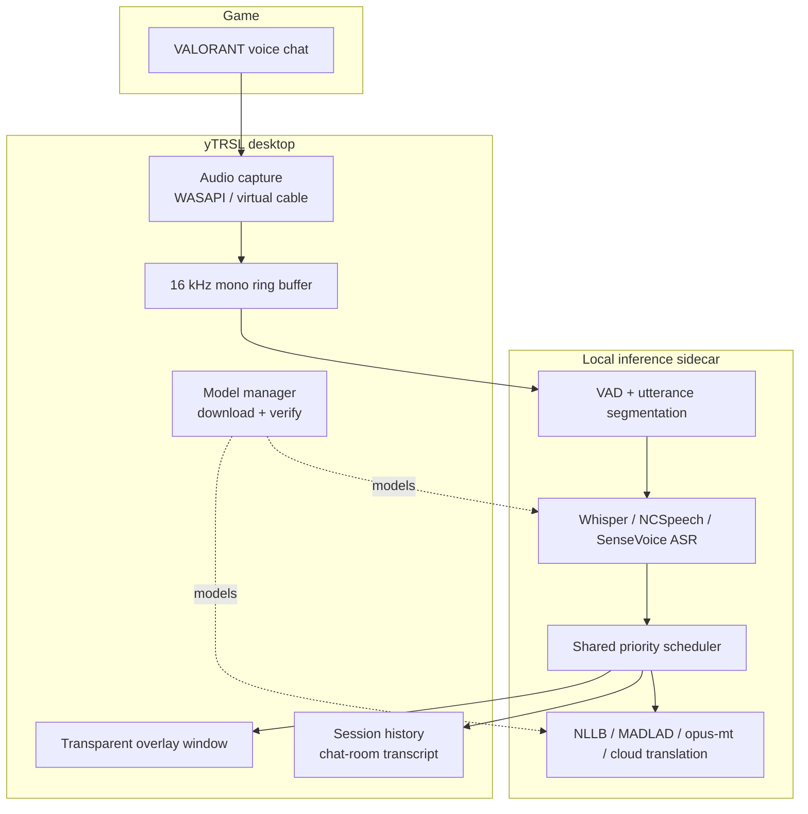
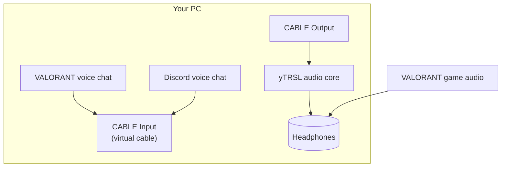
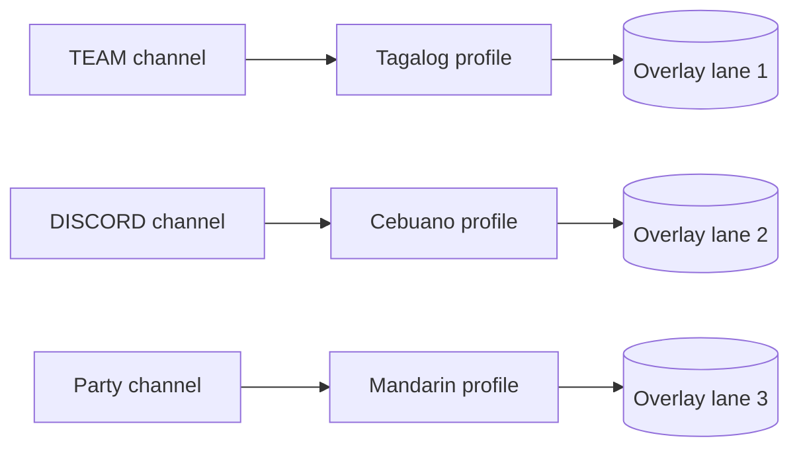
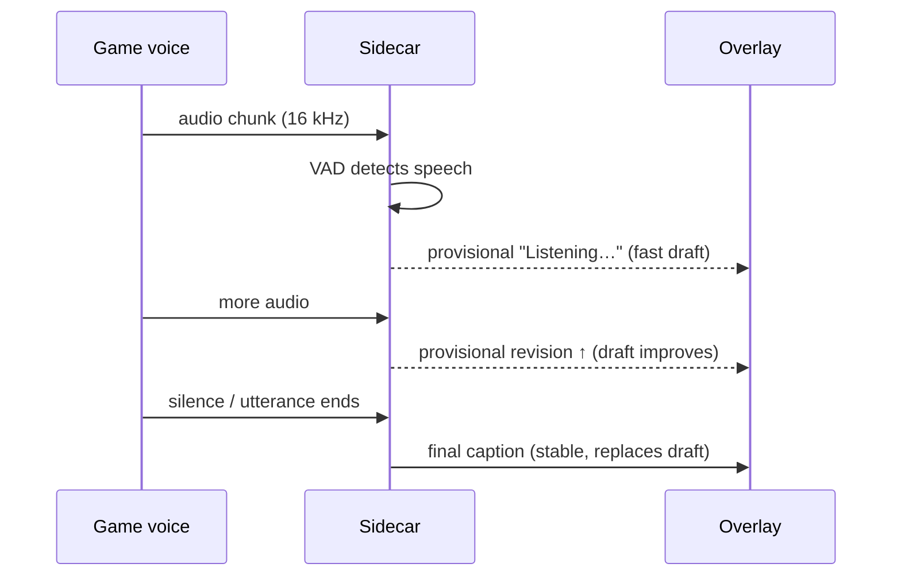

# yTRSL

**Real-time subtitles for your VALORANT voice chat — 100% local.**

Hear Tagalog, Cebuano, Chinese, Indonesian, Vietnamese, Thai, or Malay
callouts, *read* them in English (or your chosen language) as they happen,
and never send a second of audio to the cloud. Speak back: your own voice and
typed messages are translated into the team's language as right-aligned
"You" bubbles you can read aloud or copy.

<p align="center">
  
  
  
  
</p>

---

## What it does

```
"Rush B!"            yTRSL               "Rush B!" → "Rush B!"
(Tagalog voice)  ─────────────►  (English subtitle on screen)
"进攻A点"            yTRSL               "Push A site"
(you, via mic)   ─────────────►  (English "You" bubble to read/say)
```

- Listens to **your voice-chat mix** — through a virtual audio cable or any
  audio endpoint you pick.
- Recognizes **Tagalog / Filipino, Cebuano, Chinese, Indonesian, Vietnamese,
  Thai, Malay, and English**.
- Translates into **English, Filipino, Chinese, Indonesian, Vietnamese, Thai,
  or Malay** — your pick, per session.
- **Translates your own voice and typed chat** in the reverse direction (auto:
  the opposite of the live pair) into right-aligned "You" bubbles — copy them
  to paste into game chat, or read them aloud.
- Shows a **transparent, click-through overlay** above your game: a live
  caption bar, or a **chat-history panel** (newest pinned to the bottom).
- Runs **multiple sources at once** — `[TEAM]`, `[DISCORD]`, `[PARTY]` lanes,
  each with its own device, language profile, color, and caption tag, all in a
  single live session.
- Records a **session-based captions history** with a chat-room layout:
  per-caption bubbles (one bubble per finalized caption, sized to its text),
  per-source colors, a session sidebar, and a searchable, exportable
  transcript.
- Runs a **separated live session** from the History page — a second,
  independent translation of your voice with its own models, sharing the
  loaded model cache with the main session.

It never touches the game: no injection, no memory reads, no automation.
[Why that matters ↓](#safety-first-by-design)

> **Download:** get the Windows installer or macOS app from
> [GitHub Releases](https://github.com/jxstme22/ztrsl/releases/latest).
> **Status:** beta (v0.9). Works end-to-end; code signing + clean-machine
> tests are the remaining 1.0 work.

---

## Minimum requirements

### Windows

| Component | Minimum | Recommended |
|---|---|---|
| OS | Windows 11 x64 (Windows 10 may work, untested) | Windows 11 x64 |
| CPU | 4 cores | 6+ cores |
| RAM | 8 GB | 16 GB |
| Storage | 4 GB free | 10 GB free (models + optional CUDA pack) |
| GPU | None needed (CPU fallback) | NVIDIA GPU with **CUDA 12** runtime |
| Virtual cable | **VB-CABLE** (free, vb-audio.com) for game-voice capture | — |

- **GPU:** the app can run entirely on CPU. For GPU speed, either let the app
  download its **CUDA runtime pack** (~1.3 GB, one-time, from the Models tab)
  or have the **CUDA 12 Toolkit** already installed — the app detects both and
  won't re-download.
- **Voice capture:** VB-CABLE routes VALORANT/Discord voice into the app. The
  app never bundles the driver.

### macOS (Apple Silicon)

| Component | Minimum | Recommended |
|---|---|---|
| Mac | Apple Silicon (M1/M2/M3/M4) | M3 / M4 |
| macOS | macOS 13+ | latest |
| RAM | 8 GB | 16 GB |
| Storage | 3 GB free | 8 GB free (models) |
| Virtual device | **BlackHole** (free, github.com/ExistentialAudio/BlackHole) for game-voice capture | — |
| Permission | Microphone access (first capture) | — |

> The general (Windows) branch is the primary release; the macOS port lives on
> its own branch with Metal ASR and native window chrome.

### Cloud API (optional, Windows + macOS)

Local models are fully free and offline. If you prefer hosted **speech
recognition**, the app supports **Groq** (free tier) and **NVIDIA NIM**
(Parakeet / Nemotron / Canary / Whisper). For hosted **translation**, pick
**Google Translate**, **LibreTranslate**, **MyMemory**, **Baidu Translate**,
or **NVIDIA Riva** — all opt-in:

1. Get an API key (e.g. <https://console.groq.com/keys> for Groq).
2. Paste it into the Live tab under the matching provider and press Start.

> While a cloud provider is selected, only that provider's requests leave your
> machine (audio for Groq/NVIDIA ASR, text for translation). Everything else
> stays 100% local.

---

## How it works (in one picture)



**The 30-second version:**

1. Your voice-chat audio is captured from a Windows audio endpoint.
2. A small **VAD** splits the stream into "someone is talking" chunks.
3. **Speech recognition** (local Whisper or a CTC model) turns each chunk into text.
4. **Translation** (local NLLB) turns that into English.
5. A shared **scheduler** keeps finals ahead of drafts and everything bounded.
6. The **overlay** shows it on screen — labeled per source.
7. Finals land in **session history** as chat bubbles.

Your own mic (the "You" stream) runs through the same pipeline in the reverse
direction, and the chat box translates typed messages on demand. Everything
runs on your machine. No audio ever leaves it.

---

## Languages

The full 7×7 matrix works end to end — each **source mode** pairs with any
**output language**:

| Source (recognize) | Output (translate to) |
|---|---|
| Filipino / Tagalog | English `en` |
| Chinese / Mandarin | Chinese `zh` |
| English | Filipino `fil` |
| Indonesian | Indonesian `ind` |
| Vietnamese | Vietnamese `vie` |
| Thai | Thai `tha` |
| Malay | Malay `zsm` |

Pick a source mode per channel in **Sources**, then choose the translation
output for the session on the **Live** tab. Your own voice/chat direction
defaults to the reverse of the live pair (live en→zh ⇒ you zh→en) and is
configurable.

---

## VB-CABLE: how voice chat reaches yTRSL

A **virtual audio cable** is a free, user-installed Windows driver that acts as
a "software wire": whatever an app plays to its **Input** can be *captured*
from its **Output**. That's how yTRSL hears exactly the voice-chat mix — and
nothing else.



### Set it up (5 minutes)

**1. Install the cable** — download **VB-CABLE** (free) from
<https://vb-audio.com/Cable/>. Windows will now show a **CABLE Input**
(Playback) and **CABLE Output** (Recording) device pair.

**2. VALORANT voice chat → CABLE Input** — in VALORANT
`Settings → Audio → Voice Chat`, set **Output Device** to **CABLE Input**.
Your teammates' voices now play *into the cable only*.

**3. VALORANT game audio → headphones** — in VALORANT `Settings → Audio`,
keep **Speaker / Output Device** on your **headphones**. Game effects must
never go to the cable, or yTRSL will hear explosions as speech.

**4. Discord voice → the same cable** (or a second one) — in Discord
`Settings → Voice & Video`, set **Output Device** to **CABLE Input**. Route
Discord and VALORANT into the same cable to treat them as one source, or use a
second cable for a separate `[DISCORD]` lane.

**5. Keep hearing your team** — because voice now plays into the cable, turn
on **Monitor source** for the source on the **Sources** page and pick your
**headphones** as the headphone output (blend 100%). Avoid echo by letting
yTRSL be the *only* path replaying voice to your headset.

**6. Sanity check** — in **Diagnostics**, run **Isolation check**. When only
game sounds play and nobody speaks, the voice capture meter should stay
near-silent. If it jumps, game audio is leaking into the cable.

> VB-CABLE is a **separate install** — yTRSL never bundles, installs, or
> patches the driver; it only detects and routes to it when you choose to.

> **Mainland China?** All catalog models download from pinned Hugging Face
> mirrors with automatic `hf-mirror.com → modelscope.cn` failover (set
> `LST_REGION=cn` or pick the mirror in the Models tab). No GitHub-hosted
> artifacts are used.

---

## Your voice & chat ("You" bubbles)

The History page's input bar has three tools:

- **Mic toggle** — translates your own speech in the reverse direction while a
  live session runs. The mic opens only while the toggle is on; captions land
  as right-aligned "You" bubbles with a solid configurable color (default
  blue, changeable in the History settings menu).
- **Chat box** — type a message in your language, press Enter/Send, and it is
  translated on demand (works even without a live session). The bubble shows
  your original line and the translation; the copy button is right beside it.
- **Config button** — pick the microphone, your language, the translate-into
  language (auto = reverse of the live pair), and the models used.

The mic/voice stream rides the same live session and the same model cache —
no second pipeline is spawned for it. A **separated live** button in the same
config dialog starts a fully independent session of your voice with its own
models, sharing the loaded model cache with the main session.

---

## Captions history (chat room)

Every finalized caption is saved into the current session's transcript:

- **Per-caption bubbles** — one bubble per finalized caption, sized to its
  text; no speaker/avatar inside, just the caption with the copy button beside
  it. "You" bubbles sit on the right with the picked color.
- **Session sidebar** — a left column listing all sessions (newest on top);
  click one to view it, and the toggle in the toolbar hides/shows the sidebar.
- **Display options** — a Settings menu toggles the transcribed input line,
  per-source bubble tints, profile icons, and the "You" bubble color.
- **Search, copy, export** — filter the transcript, copy any bubble, and export
  as TXT/JSON/SRT/VTT/Markdown.
- **Auto-scroll** — the transcript pins to the newest bubble; scroll up to read
  older messages.

---

## Multi-source live: one session, many lanes

Configure every channel you care about on the **Sources** page — each with its
own device (cable, mic, or loopback), **caption tag** (`TEAM`, `DISCORD`, …),
**language profile**, and color. Then on the **Live** tab switch **Capture
mode → All sources** and start listening: yTRSL captures every configured
source simultaneously, VADs and translates each independently, and every
caption lands with its own tag in the overlay and History.



Each source picks a **language profile** and a **strictness**:

- **Profiles:** Tagalog · Taglish · Cebuano · Bislish · Mandarin ·
  Chinese/English · Auto
- **Strictness:** Off (accept everything) · Balanced (filter clear misses) ·
  Strict (suppress anything off-profile)
- **Tactical callouts** (`rush B`, `rotate A`, numbers) always pass, even under
  Strict — the glossary treats them as data.

> All sources share one ASR/translation model, so more sources mean more
> inference load — fine on CUDA; use the `balanced` resource profile on
> CPU-only machines.

---

## Caption lifecycle



Provisionals stream **while** someone talks; the final replaces them the moment
the utterance closes. Multiple sources each get their own lane, and the same
final lands in History as a bubble.

---

## Safety first, by design

This project deliberately stays out of the game. It never implements:

- game-process injection, DLL / graphics hooks, or memory reads;
- game-file modification, packet interception, or input automation;
- anti-cheat evasion, kernel drivers, or hidden-data extraction;
- screen analysis for tactical advantage.

It only:

- enumerates ordinary **audio endpoints** and processes local audio;
- draws a normal **transparent top-level window**;
- registers explicit **global hotkeys**;
- stores **user-approved local settings** and optional history.

That keeps it outside Vanguard's scope and makes the privacy story simple:
**local in, local out.**

---

## Repository layout

```text
.
├── apps/desktop/           Tauri 2 app — control window + caption overlay
│   ├── src/                React/TypeScript UI (Live, History, Sources…)
│   └── src-tauri/          Rust host: IPC, audio, sidecar supervision
├── crates/
│   ├── audio-core/         WASAPI capture/playback, resampling, routing
│   ├── model-manager/      verified staged model installs (multi-provider)
│   ├── ipc-protocol/       loopback WebSocket IPC schema
│   ├── sidecar-supervisor/ Python-sidecar lifecycle + shared-process pool
│   ├── translation-runner/ Rust (candle) MADLAD-400 runner
│   ├── overlay-core/       caption state machine
│   └── diagnostics/        content-free diagnostics
├── services/inference/    Python sidecar: VAD, ASR, MT, per-source direction
├── scripts/               model installers, build helpers, CI smoke harness
├── models/catalog.json    pinned, checksummed download catalog (embedded)
└── docs/                  PRD, architecture, ADRs, phase evidence
```

---

## Getting started (developers)

**Prereqs:** Windows 11 x64 · Node.js 22+ (Corepack) · pnpm · stable Rust ·
Python 3.11–3.13 · `uv`

```powershell
corepack enable
pnpm install --frozen-lockfile
uv sync --extra dev --extra models
```

Run the app:

```powershell
cd apps/desktop
pnpm tauri dev
```

Sanity checks:

```powershell
cargo test -p sidecar-supervisor -p ipc-protocol -p audio-core
cd apps/desktop && pnpm test && pnpm typecheck && pnpm lint
.venv\Scripts\python -m pytest services\inference\tests -q
.venv\Scripts\python -m ruff check services\inference
```

### Models

The app downloads models itself on first run (pinned, checksum-verified, with a
confirmation dialog). Prefer the CLI in development:

```powershell
python scripts/install_models.py whisper-turbo --accept-license
python scripts/install_models.py nllb --accept-license
python scripts/install_models.py madlad --accept-license   # optional, CPU-only
```

On macOS, also install the Apple Silicon ASR model from the macOS branch's
catalog (`mlx-whisper-large-v3-turbo-q4`).

Can't reach Hugging Face? The Models tab can use `hf-mirror.com` (or
`LST_REGION=cn`), and offline packs install with zero network.

---

## Model licenses

Models keep their **own** licenses, separate from the project's Apache-2.0 code:

| Model | Kind | Runtime | License |
|---|---|---|---|
| faster-whisper large-v3 / turbo | ASR | CTranslate2 | MIT |
| MLX Whisper large-v3-turbo q4 (macOS) | ASR | MLX | MIT |
| OmniLingual CTC 300M | ASR | sherpa-onnx | Apache-2.0 |
| FunASR Paraformer zh (streaming) | ASR | sherpa-onnx | Apache-2.0 |
| SenseVoice Small (zh/en/ja/ko/yue) | ASR | sherpa-onnx | Apache-2.0 |
| Helsinki opus-mt (en→zh, zh→en) | Translation | CTranslate2 | Apache-2.0 |
| NLLB-200 distilled 600M | Translation | CTranslate2 | **CC-BY-NC-4.0** (non-commercial) |
| MADLAD-400 3B | Translation | candle | Apache-2.0 |

---

## User documentation

- [Setup guide](docs/17_SETUP_GUIDE.md) — includes the VB-CABLE handoff
- [Sources & labels](docs/18_SOURCES_AND_LABELS.md)
- [Language profiles & strictness](docs/19_LANGUAGE_PROFILES.md)
- [Models & downloads](docs/20_MODELS_AND_DOWNLOADS.md)
- [Diagnostics & troubleshooting](docs/21_DIAGNOSTICS_TROUBLESHOOTING.md)
- [FAQ](docs/22_FAQ.md)
- [Release notes](docs/23_RELEASE_NOTES.md)

## For contributors

- [Contributing](CONTRIBUTING.md) — including the hard safety boundary list
- [Security policy](SECURITY.md)
- Formal design docs in [`docs/`](docs/README.md) — PRD, architecture, ADRs,
  and per-phase evidence.

---

## Roadmap to 1.0

Current release: **v0.9.2** (beta — Windows 11 + macOS, 7-language matrix,
chat-history overlay, per-caption bubbles, session sidebar, your-voice + typed
chat translation, separated live, full i18n, multi-source live). Working
toward 1.0:

- [x] macOS support (Apple Silicon, MLX Metal ASR — macOS branch)
- [x] full English/Chinese i18n
- [x] live caption + chat-history overlay with per-source colors
- [x] 7-language source × output matrix
- [x] move/customize overlay controls on the Live tab
- [x] multi-source live sessions (per-source capture + tags)
- [x] Windows sidecar crash auto-recovery
- [x] your-voice mic translation + typed chat translation
- [x] per-caption chat-room history with session sidebar
- [ ] code signing (Windows SmartScreen, macOS notarization)
- [ ] clean-machine installer walkthrough (the last hardware gate)
- [ ] native-speaker accuracy benchmarks (Tagalog/Cebuano)
- [ ] opt-in API keys → OS keychain
- [ ] auto-update

## License

Copyright (c) 2026 the yTRSL contributors. Licensed under the
[Apache License 2.0](LICENSE).

*VALORANT is a trademark of Riot Games, Inc. This project is not affiliated
with, endorsed by, or sponsored by Riot Games.*
