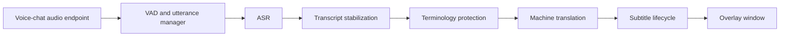
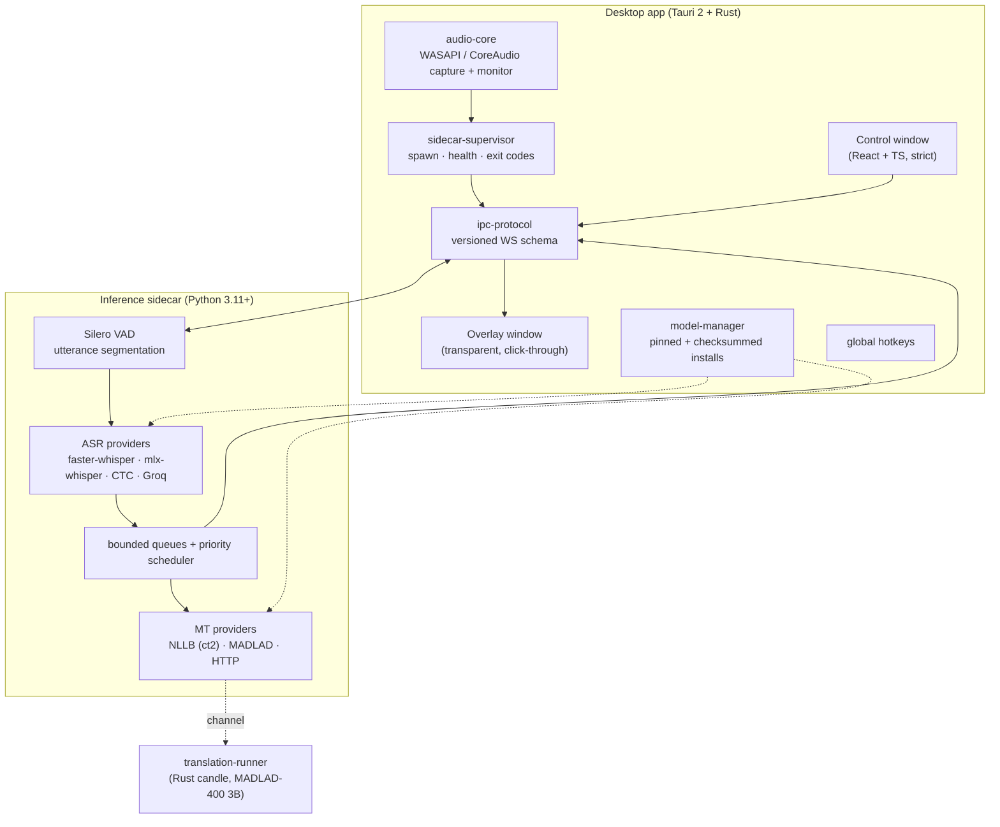
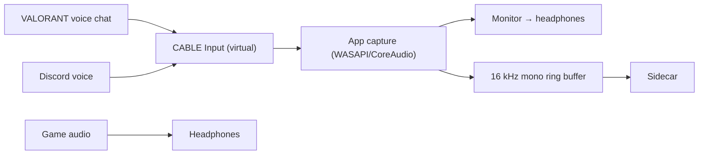
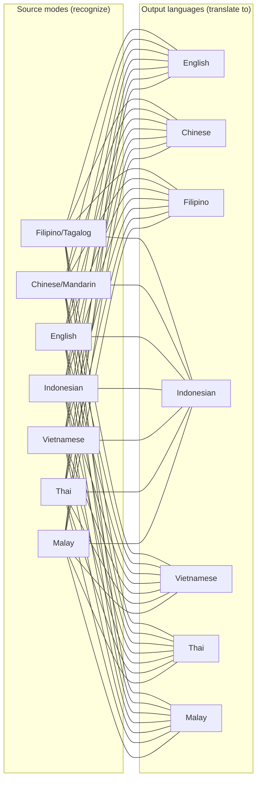
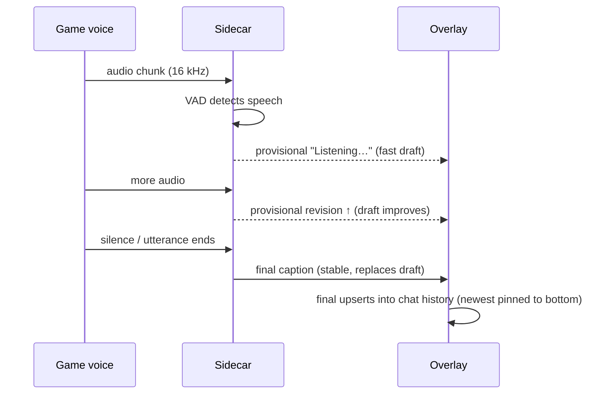
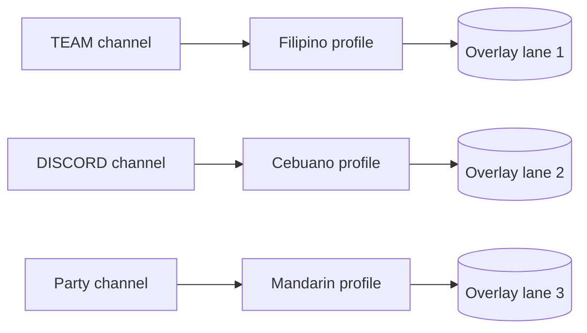
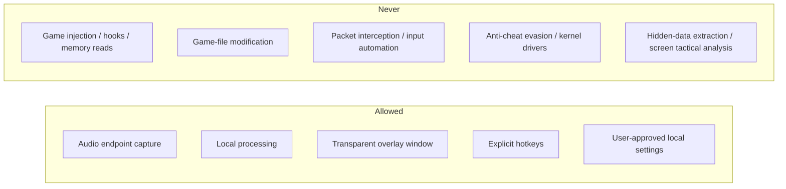

# Project Overview (xTRSNLTR)

*Current state: **v0.6.4** (beta) — Windows 11 + macOS, 7×7 language matrix,
chat-history overlay, full English/Chinese i18n.*

## Product

A desktop application that translates incoming VALORANT voice communication
into readable subtitles in real time. It hears Tagalog/Filipino, Cebuano,
Chinese, Indonesian, Vietnamese, Thai, Malay, and English — and renders them
in any of seven output languages — entirely on the user's machine.

## User Story

> While playing VALORANT with friends who speak Tagalog or Cebuano, I want
> English subtitles over the game so I can understand tactical calls without
> sending audio to a cloud service.

## Why the Architecture Is Cascaded

The project requires:

- access to the source transcript for debugging and correction;
- support for Cebuano and other low-resource languages that general speech
  systems cover poorly;
- terminology protection for map locations, agents, weapons, and gaming slang;
- separate latency control for speech recognition and translation;
- a practical way to improve final captions without delaying provisional
  output.

Therefore:



## Current System Architecture

Three processes cooperate. The **Tauri app** owns the desktop experience
(control window, overlay window, audio capture, hotkeys). The **Python
sidecar** owns inference (VAD → ASR → MT). The optional **translation-runner**
(Rust, candle) runs MADLAD-400 translation. They talk over a versioned
loopback WebSocket protocol.



**Latency responsibilities:**

| Stage | Responsible | Budget |
|---|---|---|
| Audio capture | audio-core (WASAPI/CoreAudio) | ~10 ms |
| VAD / segmentation | sidecar | real time |
| ASR (whisper-turbo local) | sidecar (GPU/CUDA or Metal, CPU fallback) | ~200–800 ms |
| MT (NLLB 600M int8) | sidecar (CUDA or CPU) | tens of ms (GPU) / ~340 ms (M-series CPU) |
| Caption lifecycle | overlay-core (provisional → final) | async |

## Audio Strategy (V1 shipped)

Route VALORANT voice-chat output to a user-installed virtual audio device
(VB-CABLE on Windows, BlackHole on macOS). The app captures that endpoint,
monitors it back to the user's headphones, and feeds a mono 16 kHz copy to the
sidecar.

Reasons:

- it isolates voice chat better than capturing the full game mix;
- it never touches the game process;
- it is understandable and testable;
- it avoids developing and distributing a driver.



## AI Strategy (current)

```text
Silero VAD
→ faster-whisper large-v3-turbo (default) / mlx-whisper (macOS Metal)
  / NCSpeech CTC exports / Groq API (opt-in)
→ transcript stabilization + VALORANT glossary
→ NLLB-200 distilled 600M (default) / MADLAD-400 3B / HTTP providers
→ subtitles in the chosen output language
```

The game owns resource priority: the app runs bounded queues, ring buffers,
and explicit backpressure everywhere; it never blocks the audio callback and
never does GPU work on the UI thread.

## Language Matrix (v0.6.3+)



Every source mode pairs with every output language. NLLB maps to
`tgl_Latn / ind_Latn / vie_Latn / tha_Thai / zsm_Latn`; Whisper maps to
`fil / zh / en / id / vi / th / ms`; HTTP providers map to `tl / zh / id / vi
/ th / ms` (Google/MyMemory/LibreTranslate/custom). Output choice applies to
the local NLLB provider; MADLAD is fixed to English.

## Caption Lifecycle



Provisionals stream while someone talks; the final replaces them when the
utterance closes. Only **final** captions enter history — the persisted
10-entry ring buffer that the overlay's chat panel (5/10/default rows) reads.

## Overlay & Multi-Source



- Two surfaces: a **live caption bar** (latest caption, per-source colors and
  alignment) and a **history panel** (chat transcript, newest at the bottom).
- The overlay is an ordinary transparent top-level window: click-through in
  play mode, movable/focusable in edit mode, hotkey-driven, with persisted
  placement across monitors.
- Customize from the Live tab: text size, background transparency, panel
  height, source colors, row cap, simultaneous-caption policy, and more.

## Delivery Strategy (completed phases)

| Phase | What | Evidence |
|---|---|---|
| 0 | Repo + diagnostics | repo, CI |
| 1 | Overlay only | overlay window, click-through |
| 2 | Endpoint enumeration + meter | audio-core |
| 3 | Capture + monitor routing | WASAPI/CoreAudio routing |
| 4 | VAD + utterance segmentation | Silero VAD |
| 5 | Fake ASR/MT vertical slice | demo provider |
| 6 | Real ASR | whisper-turbo / mlx / CTC / Groq |
| 7 | Real translation | NLLB / MADLAD / HTTP |
| 8 | Latency stabilization | bounded queues, priority scheduler |
| 9 | In-game validation | field tests |
| 10 | Packaging + model manager | installers, checksummed catalog |
| 11 | Native-runtime optimization | translation-runner (candle) |

Current release cadence: tag-based GitHub Actions builds — Windows installer
(NSIS) + macOS app bundle (DMG) per release, CI runs `cargo test --workspace`,
frontend vitest/eslint/tsc, and the Python sidecar suite.

## Key UX (shipped)

The overlay shows:

- optional smaller source transcript;
- prominent translation;
- provisional vs final visual states;
- per-source colored labels;
- chat history with configurable row cap;
- connection/model status outside active gameplay;
- global hotkeys, font size, position, and appearance controls.

The overlay must not:

- steal keyboard or mouse focus;
- mimic official VALORANT UI;
- display tactical information extracted from the game;
- obstruct critical HUD areas by default.

## Main Risks (current)

1. Low-resource conversational accuracy (Cebuano, Malay, Thai, Vietnamese).
2. Code-switching with English gaming terms.
3. Virtual-device setup complexity (VB-CABLE/BlackHole).
4. Audio-forwarding echo or latency.
5. GPU contention with VALORANT (CUDA/Metal shared with the game).
6. Overlay behavior across display modes and multi-monitor setups.
7. Third-party product policy and anti-cheat perception.
8. Distribution size and model licensing (NLLB is CC-BY-NC-4.0).
9. Code signing/notarization for clean-machine installs.

## Safety Boundary (hard)



See `09_SECURITY_PRIVACY_RIOT_COMPLIANCE.md` for binding rules.

## Success Criteria

A successful V1:

- works in Borderless Windowed mode;
- translates finalized utterances locally;
- maintains acceptable game performance;
- survives device changes and model errors;
- does not persist raw audio by default;
- provides measured rather than assumed quality.

See `15_ACCEPTANCE_CHECKLIST.md` for binding criteria.
