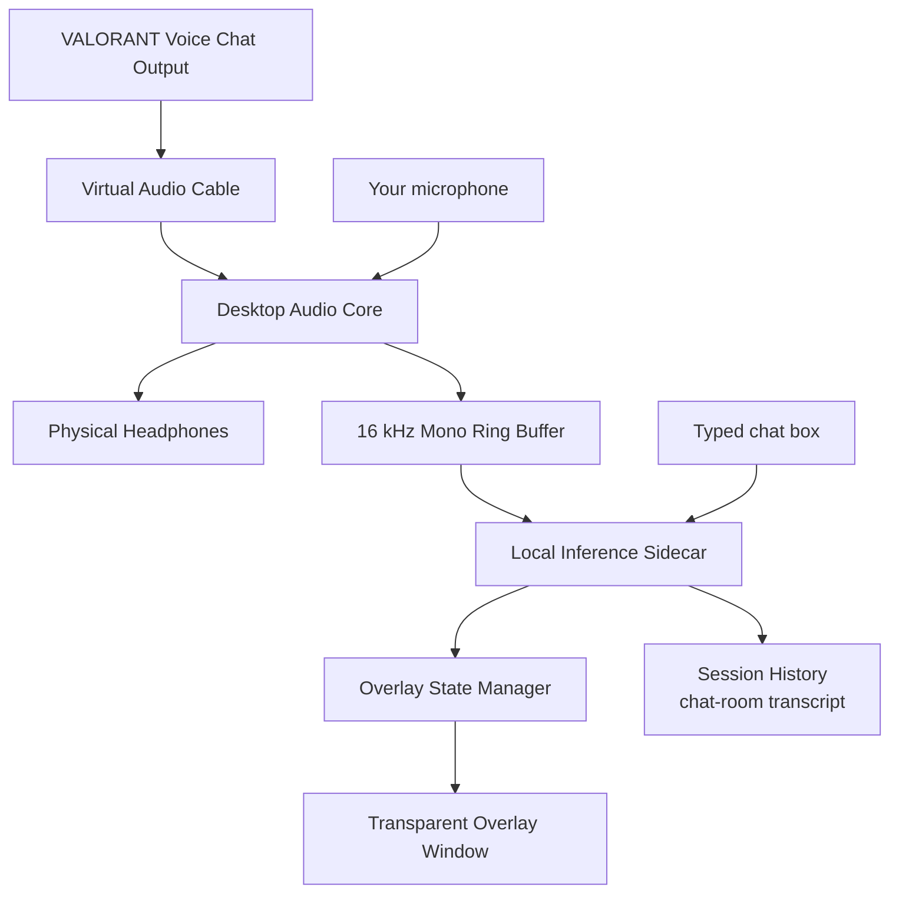

# System Architecture

## 1. Context

The product is an external Windows application. It does not integrate with VALORANT APIs or the game process. A macOS port lives on a separate branch; the general (Windows) branch is the primary release.



The desktop and the overlay are separate windows in one Tauri app. The history transcript lives in the desktop app and is mirrored to the overlay window via a shared localStorage + a `captions:history` Tauri event.

## 2. Process Model

### Desktop Process

Responsibilities:

- device enumeration;
- capture and playback (team channels, loopback, and the user's own mic);
- resampling to 16 kHz mono;
- overlay window (transparent, click-through);
- settings and model manager UI;
- sidecar lifecycle and the shared live-sidecar pool;
- the History page (session sidebar, per-caption bubbles, search, export);
- typed-chat translation (one-shot sidecar requests);
- diagnostics;
- global hotkeys.

### Inference Sidecar

Responsibilities:

- VAD + utterance segmentation (per source);
- ASR;
- transcript stabilization;
- language heuristics;
- terminology protection;
- translation (per-source direction supported);
- result timing;
- model health;
- one-shot `translate.text` for the chat box.

The sidecar is a WebSocket server: **each live session is its own connection**
(main live, separated live, clip analysis, chat). Provider factories are
cached per process, so multiple connections on one process share loaded models.

### Why a Sidecar First

Benefits:

- fastest path to use PyTorch/Transformers;
- easier model experimentation;
- simpler GPU debugging;
- tests can fake inference;
- desktop remains responsive if inference restarts.

Costs:

- packaging complexity;
- Python environment size;
- IPC overhead;
- larger attack surface;
- slower startup.

The sidecar is an implementation stage, not a permanent requirement. Native migration is benchmark-driven.

## 3. Threading and Concurrency

### Desktop

Suggested threads/tasks:

```text
UI main thread
Audio capture callback/thread (per source)
Audio playback callback/thread
Resampling worker
IPC writer
IPC reader
Diagnostics sampler
Sidecar supervisor
Live worker thread (per live session)
```

Rules:

- capture callback writes to a lock-free or bounded ring buffer;
- playback reads from a dedicated monitoring ring buffer;
- inference feed reads a copy/branch;
- callbacks never wait for network, disk, model, or UI;
- buffer overflow increments a metric and drops oldest inference-only samples before disrupting monitoring;
- audio monitoring takes priority over ASR feed.

### Sidecar

Suggested workers:

```text
IPC receive task (per connection)
VAD/segmenter thread
ASR worker: concurrency 1
Translation worker: concurrency 1
IPC send task
Health sampler
```

Use bounded queues:

| Queue | Suggested capacity | Overflow policy |
|---|---:|---|
| audio frames | 2–5 seconds | drop oldest inference frames; report |
| utterances | 3 | reject/drop oldest stale provisional |
| ASR results | 8 | coalesce by utterance ID |
| translation jobs | 4 | replace stale provisional job |
| outgoing captions | 32 | coalesce by caption ID |

### Shared sidecar pool

A `SidecarPool` keeps a `Weak<SidecarProcess>` to the most recent live sidecar.
When a new live session starts, it attaches a **second connection to the same
process** (sharing the loaded model cache) instead of spawning a fresh one —
only genuinely-different models load a second time. The process is terminated
when the **last** connection closes (`Arc` refcount), so stopping one live
session never kills another. A transport failure that requires a process
restart is only allowed while the session is the sole owner of the process.

## 4. Data Flow

### Startup

1. Desktop loads settings.
2. Desktop starts overlay hidden.
3. Desktop starts sidecar with:
   - random IPC token;
   - localhost port;
   - model directory;
   - selected resource profile.
4. Sidecar reports protocol version and health.
5. Desktop enumerates devices.
6. User starts routing test.
7. Capture and playback begin.
8. Translation is enabled only after health passes.

### Speech Path (team channels)

1. Capture timestamps audio frame using monotonic clock.
2. Downmix and resample to 16 kHz mono.
3. Send frame to the sidecar over the live connection.
4. VAD creates/updates the per-source utterance.
5. Segmenter may request a provisional decode.
6. ASR returns source text (source-mode aware).
7. Stabilizer computes stable prefix.
8. Protected-term layer masks terms.
9. Translation generates the output (per-source direction if set).
10. Masks are restored and text normalized.
11. Result is sent to desktop as `caption.provisional` / `caption.final`.
12. Desktop updates overlay without taking focus, and finals land in History.

### Your-voice mic stream ("You")

The mic is a second **source** on the same live connection (`source_origin:
physical_microphone`, a fixed "you" source id). Its language profile is the
reverse of the live pair by default. The desktop capture loop opens the mic
device only while the mic toggle is on (a shared `mic_enabled` flag); when the
toggle is enabled mid-session, the loop re-pushes the source registry so
captions carry the "you" tag/color. Translation uses a per-source direction:
the sidecar builds a provider for the source's target language (cached per
direction), so the mic can translate opposite to the session default without a
second pipeline.

### Typed chat

The chat box sends a `translate.text` control on a **dedicated chat sidecar**
(separate from the live/clip sidecars, so starting/stopping a live session
never kills it). The sidecar builds the requested provider (cached), translates
the text, and returns `translate.result`; the desktop records a "you" history
bubble.

### Separated live

The History page's config dialog can start a **second live session** of your
own voice with its own models. It attaches to the shared sidecar process (model
cache reuse) and records into the same history transcript with the "you"
identity. Stop/start controls live inside the config modal.

### Finalization

An utterance finalizes when:

- VAD silence exceeds threshold;
- maximum utterance duration is reached;
- input endpoint ends;
- user clears session;
- sidecar performs forced flush on shutdown.

## 5. Clocking

Use monotonic timestamps for latency.

Every audio frame should contain:

```text
session_id
sequence_number
source_id (v2 multi-source)
capture_monotonic_ns
sample_rate
channels
sample_format
sample_count
payload
```

Sequence numbers are session-global and strictly increasing across sources.
Do not use wall-clock time for duration calculations.

The desktop is the clock authority. Sidecar returns received/start/end times to allow stage timing.

## 6. Component Interfaces

### AudioSource

```rust
trait AudioSource {
    fn enumerate() -> Result<Vec<AudioEndpoint>>;
    fn start(&mut self, endpoint_id: &str, sink: AudioFrameSink) -> Result<()>;
    fn stop(&mut self) -> Result<()>;
}
```

### AudioMonitor

```rust
trait AudioMonitor {
    fn start(&mut self, endpoint_id: &str, format: AudioFormat) -> Result<()>;
    fn set_volume(&mut self, volume: f32);
    fn stop(&mut self) -> Result<()>;
}
```

### InferenceProvider

```python
class AsrProvider(Protocol):
    def transcribe(self, utterance: AudioUtterance, mode: SourceMode) -> AsrResult: ...


class TranslationProvider(Protocol):
    def translate(self, result: AsrResult) -> TranslationResult: ...
```

### LivePipeline

One pipeline per live connection; VAD state is per source id. Per-source
overrides:

- source mode (ASR language) via the source registry's `language_profile`;
- translation direction via the registry's `target_language` +
  `translation_provider` (e.g. the user's mic reversed from the session).

### OverlayStore

Must support:

- upsert provisional;
- finalize;
- expire;
- clear;
- status banner outside play mode;
- per-source lanes (source id key).

### HistoryStore

Session-scoped, persisted (localStorage `lst.captions.history.v2`):

- upsert by caption id within a session;
- chat entries (`recordChat`) with the "you" identity;
- dedupe window for repeated finals;
- `SESSION_MAX_ENTRIES` cap per session;
- mirrored to the overlay window.

## 7. Resource Profiles

### Low

- ASR: 300M int8.
- Translation: aggressive quantization or CPU/GPU split.
- Longer provisional interval.
- Translation only at phrase boundaries.
- Source text optional.

### Balanced

- ASR: 300M int8.
- Translation: quantized 3B.
- Provisional translation every stable phrase.
- Default.

### Quality

- ASR: 1B int8 if benchmark passes.
- Translation: higher precision if VRAM allows.
- Longer final correction window.
- Not selected automatically while game is active.

## 8. Persistence

Allowed by default:

- app settings;
- model manifests;
- aggregate local benchmark metrics without content;
- non-sensitive crash metadata.

Disabled by default:

- raw audio;
- source transcripts;
- translations;
- usernames;
- session history.

Session history is opt-in in practice: nothing is recorded until a live
session or standalone chat creates one, and it is capped (2 000 entries per
session) and deletable.

Diagnostic recording must:

- display a visible active indicator;
- require explicit enablement;
- state output location;
- auto-expire or be easy to delete;
- never start automatically after an update.

## 9. Upgrade Path

1. Python sidecar.
2. Export/consume ASR through sherpa-onnx.
3. Benchmark ONNX/CTranslate2 or another validated translation runtime.
4. Move VAD and ASR into Rust/native process if stable.
5. Keep a model-provider interface for future replacement.
6. Never migrate based only on architectural preference; require measured improvement.
