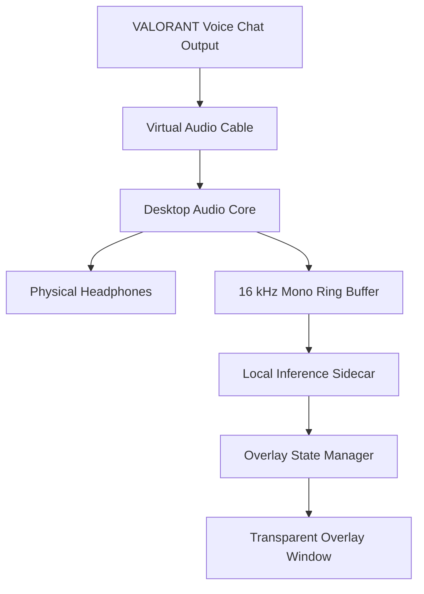

# System Architecture

## 1. Context

The product is an external Windows application. It does not integrate with VALORANT APIs or the game process.



## 2. Process Model

### Desktop Process

Responsibilities:

- device enumeration;
- capture and playback;
- resampling;
- ring buffers;
- overlay window;
- settings;
- model manager UI;
- sidecar lifecycle;
- diagnostics;
- global hotkeys.

### Inference Sidecar

Responsibilities:

- VAD;
- utterance segmentation;
- ASR;
- transcript stabilization;
- language heuristics;
- terminology protection;
- translation;
- result timing;
- model health.

### Why a Sidecar First

Benefits:

- fastest path to use PyTorch/Transformers;
- easier model experimentation;
- simpler GPU debugging;
- tests can fake inference;
- desktop remains responsive if inference restarts.

Costs:

- packaging complexity;
- Python environment size;
- IPC overhead;
- larger attack surface;
- slower startup.

The sidecar is an implementation stage, not a permanent requirement. Native migration is benchmark-driven.

## 3. Threading and Concurrency

### Desktop

Suggested threads/tasks:

```text
UI main thread
Audio capture callback/thread
Audio playback callback/thread
Resampling worker
IPC writer
IPC reader
Diagnostics sampler
Sidecar supervisor
```

Rules:

- capture callback writes to a lock-free or bounded ring buffer;
- playback reads from a dedicated monitoring ring buffer;
- inference feed reads a copy/branch;
- callbacks never wait for network, disk, model, or UI;
- buffer overflow increments a metric and drops oldest inference-only samples before disrupting monitoring;
- audio monitoring takes priority over ASR feed.

### Sidecar

Suggested workers:

```text
IPC receive task
VAD/segmenter
ASR worker: concurrency 1
Translation worker: concurrency 1
IPC send task
Health sampler
```

Use bounded queues:

| Queue | Suggested capacity | Overflow policy |
|---|---:|---|
| audio frames | 2–5 seconds | drop oldest inference frames; report |
| utterances | 3 | reject/drop oldest stale provisional |
| ASR results | 8 | coalesce by utterance ID |
| translation jobs | 4 | replace stale provisional job |
| outgoing captions | 32 | coalesce by caption ID |

## 4. Data Flow

### Startup

1. Desktop loads settings.
2. Desktop starts overlay hidden.
3. Desktop starts sidecar with:
   - random IPC token;
   - localhost port or named-pipe identifier;
   - model directory;
   - selected resource profile.
4. Sidecar reports protocol version and health.
5. Desktop enumerates devices.
6. User starts routing test.
7. Capture and playback begin.
8. Translation is enabled only after health passes.

### Speech Path

1. Capture timestamps audio frame using monotonic clock.
2. Downmix and resample copy.
3. Send frame to sidecar.
4. VAD creates/updates utterance.
5. Segmenter may request a provisional decode.
6. ASR returns source text.
7. Stabilizer computes stable prefix.
8. Protected-term layer masks terms.
9. Translation generates English.
10. Masks are restored and text normalized.
11. Result is sent to desktop.
12. Desktop updates overlay without taking focus.

### Finalization

An utterance finalizes when:

- VAD silence exceeds threshold;
- maximum utterance duration is reached;
- input endpoint ends;
- user clears session;
- sidecar performs forced flush on shutdown.

## 5. Clocking

Use monotonic timestamps for latency.

Every audio frame should contain:

```text
session_id
sequence_number
capture_monotonic_ns
sample_rate
channels
sample_format
sample_count
payload
```

Do not use wall-clock time for duration calculations.

The desktop is the clock authority. Sidecar returns received/start/end times to allow stage timing.

## 6. Component Interfaces

### AudioSource

```rust
trait AudioSource {
    fn enumerate() -> Result<Vec<AudioEndpoint>>;
    fn start(&mut self, endpoint_id: &str, sink: AudioFrameSink) -> Result<()>;
    fn stop(&mut self) -> Result<()>;
}
```

### AudioMonitor

```rust
trait AudioMonitor {
    fn start(&mut self, endpoint_id: &str, format: AudioFormat) -> Result<()>;
    fn set_volume(&mut self, volume: f32);
    fn stop(&mut self) -> Result<()>;
}
```

### InferenceProvider

```python
class AsrProvider(Protocol):
    def transcribe(self, utterance: AudioUtterance, mode: SourceMode) -> AsrResult: ...


class TranslationProvider(Protocol):
    def translate(self, text: str, source: SourceMode) -> TranslationResult: ...
```

### OverlayStore

Must support:

- upsert provisional;
- finalize;
- expire;
- clear;
- status banner outside play mode.

## 7. Resource Profiles

### Low

- ASR: 300M int8.
- Translation: aggressive quantization or CPU/GPU split.
- Longer provisional interval.
- Translation only at phrase boundaries.
- Source text optional.

### Balanced

- ASR: 300M int8.
- Translation: quantized 3B.
- Provisional translation every stable phrase.
- Default.

### Quality

- ASR: 1B int8 if benchmark passes.
- Translation: higher precision if VRAM allows.
- Longer final correction window.
- Not selected automatically while game is active.

## 8. Persistence

Allowed by default:

- app settings;
- model manifests;
- aggregate local benchmark metrics without content;
- non-sensitive crash metadata.

Disabled by default:

- raw audio;
- source transcripts;
- translations;
- usernames;
- session history.

Diagnostic recording must:

- display a visible active indicator;
- require explicit enablement;
- state output location;
- auto-expire or be easy to delete;
- never start automatically after an update.

## 9. Upgrade Path

1. Python sidecar.
2. Export/consume ASR through sherpa-onnx.
3. Benchmark ONNX/CTranslate2 or another validated translation runtime.
4. Move VAD and ASR into Rust/native process if stable.
5. Keep a model-provider interface for future replacement.
6. Never migrate based only on architectural preference; require measured improvement.
