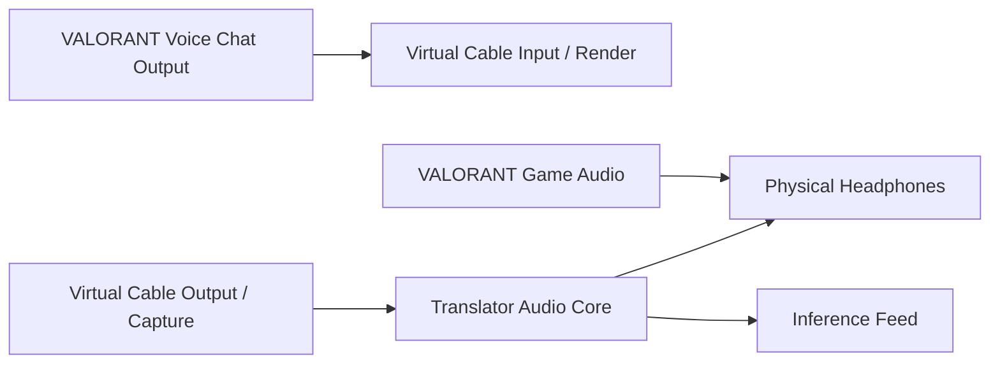

# Windows Audio Routing and Capture

## 1. Goal

Capture incoming voice-chat audio separately from VALORANT game effects while continuing to play the voice audio through the user's headphones.

## 2. Recommended V1 Topology



Names vary by virtual cable vendor. The setup wizard must show endpoint names detected on the current machine rather than relying only on generic labels.

## 3. First-Run Setup Wizard

### Step 1: Detect Candidate Virtual Devices

Heuristics:

- endpoint names containing known cable terms;
- endpoint pairs sharing vendor/product identifiers;
- non-default devices with loopback/cable characteristics.

Do not silently choose a device.

### Step 2: Ask User to Configure VALORANT

Provide instructions to set:

- game audio output → physical headphones;
- voice chat output → virtual cable render/input.

The app must state that game menus may change and the user should confirm the current output fields.

### Step 3: Select Monitoring Device

Select physical headphones. Warn if:

- same endpoint as capture;
- a microphone;
- disconnected;
- exclusive-mode conflict;
- Bluetooth hands-free profile with low quality.

### Step 4: Routing Test

Play or receive voice through the cable and show:

- capture meter;
- monitoring meter;
- round-trip status;
- clipping;
- estimated monitor buffer delay.

### Step 5: Silence Test

When only game sounds are playing and nobody is speaking, the voice capture meter should remain near silent. If not, explain that the wrong endpoint may be selected or the game is routing all audio into the cable.

## 4. WASAPI Mode

Use shared mode for broad compatibility.

Requirements:

- event-driven capture/playback where supported;
- endpoint-native format discovery;
- monotonic timestamps;
- device-notification subscription;
- no blocking work in callback;
- explicit recovery after `AUDCLNT_E_DEVICE_INVALIDATED`.

For standard render endpoint loopback, WASAPI captures the mix rendered to that endpoint. A virtual cable gives the product a dedicated endpoint mix.

## 5. Capture and Monitoring Paths

Branch early:

```text
Captured native-format frame
├── monitoring queue → physical playback
└── inference queue → downmix → resample → VAD/ASR
```

The monitoring branch must not wait for inference.

## 6. Buffering

Initial values to benchmark:

- native capture period: endpoint minimum/default shared period;
- monitor ring buffer: 40–120 ms;
- inference frame size: 20 or 30 ms;
- resampler chunk: 20–60 ms;
- maximum inference backlog: 2–5 seconds.

Underrun policy:

- output silence for missing monitor frames;
- increment metric;
- preserve capture.

Overflow policy:

- preserve latest monitoring audio where possible;
- drop stale inference samples first;
- never allow unbounded growth.

## 7. Channel Handling

Voice endpoints may be stereo.

For ASR mono:

```text
mono = 0.5 * left + 0.5 * right
```

For more channels, use a documented weighted downmix or Windows channel mask. Clamp only after gain application and report clipping.

Do not modify monitoring channels unnecessarily.

## 8. Resampling

Preferred:

- high-quality streaming resampler;
- state preserved across chunks;
- no discontinuity between frames;
- input rate discovered dynamically;
- output fixed at 16 kHz mono.

Test common rates:

- 44.1 kHz;
- 48 kHz;
- 96 kHz.

## 9. Feedback Prevention

Prevent configurations where monitored output is routed back into captured input.

Signals:

- same endpoint ID or paired endpoint loop;
- rapidly growing repeated waveform correlation;
- VAD continuously active after monitoring starts;
- capture level tracks app playback with no external source.

On suspected feedback:

1. mute monitoring;
2. preserve translation capture if safe;
3. show corrective instructions;
4. require user confirmation before reenabling.

## 10. Endpoint Changes

On device removal:

- stop affected client;
- keep UI and sidecar alive;
- mark endpoint unavailable;
- attempt reconnection only to the same endpoint ID for a bounded period;
- do not silently switch to speakers;
- offer explicit replacement selection.

On default-device changes, do not switch unless the user chose “follow default.”

## 11. Application Loopback Research Branch

Windows application loopback may capture a target process tree. It is not the V1 default because:

- voice and game effects may be in the same process;
- process identity may change across launchers/components;
- anti-cheat perception is more sensitive;
- implementation and testing are more complex;
- routing isolation is less predictable.

Any experiment must remain a normal documented Windows capture API and must not inspect or manipulate the game process beyond what the official API requires.

## 12. Virtual Cable Distribution

For personal development:

- user installs a signed third-party virtual cable separately.

For public distribution:

- do not rebundle the driver without written redistribution rights;
- link to the vendor's official installation path;
- verify publisher signature;
- document removal;
- provide an alternative manual routing guide.

## 13. Audio Tests

Automated:

- ring-buffer wraparound;
- downmix;
- resampling duration;
- clipping behavior;
- sequence gap handling;
- overflow/underrun metrics;
- endpoint config validation.

Manual:

- USB headset;
- 3.5 mm headset;
- Bluetooth stereo;
- device unplug/replug;
- sleep/wake;
- changing default device;
- game restart;
- sidecar restart;
- two-hour monitoring soak.
