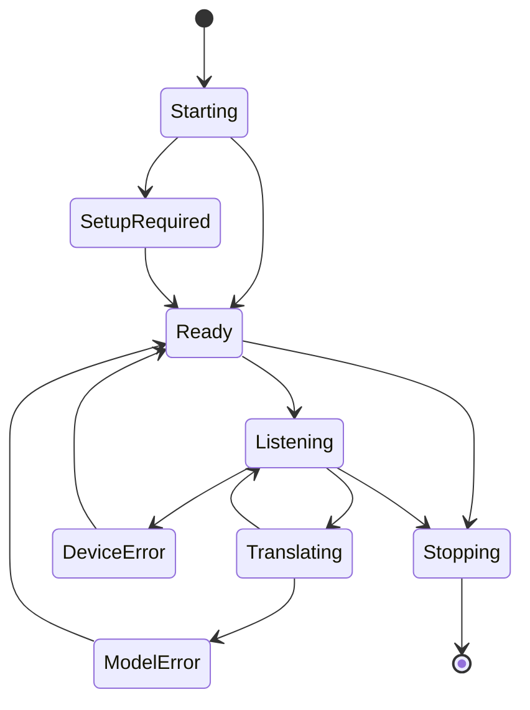

# Overlay and Desktop Application

## 1. Window Types

### Control Window

Normal desktop window for:

- setup;
- settings;
- device selection;
- diagnostics;
- model management;
- privacy controls;
- benchmark tools.

### Caption Overlay

Separate window:

- frameless;
- transparent;
- topmost;
- hidden from taskbar if supported;
- non-activating;
- click-through in play mode;
- interactive only in edit mode.

## 2. Overlay Safety

The overlay must be an ordinary external top-level window.

Forbidden:

- graphics injection;
- swap-chain hooks;
- DirectX hooks;
- game-process handles for memory access;
- kernel components;
- input synthesis.

## 3. Display Mode

V1 supports:

- Borderless Windowed;
- Windowed.

True exclusive fullscreen is not required. Setup should detect or explain when the overlay is hidden by display mode.

## 4. Caption Layout

Default:

```text
            source transcript, smaller and dimmer
        English translation, larger and high contrast
```

Constraints:

- maximum two displayed caption entries;
- maximum two lines per entry by default;
- safe width 40–70% of monitor;
- centered near lower third, not directly on crosshair;
- background with configurable opacity;
- no rapid animations.

## 5. Caption States

### Provisional

- lower opacity;
- subtle indicator;
- may revise;
- short expiration if abandoned.

### Final

- full opacity;
- stable;
- remains for reading duration based on text length;
- fades or disappears with reduced-motion alternative.

### Error/Status

Do not show technical errors over gameplay unless essential. Use small concise messages:

```text
Translator paused
Voice device disconnected
Local model unavailable
```

Detailed errors belong in the control window.

## 6. Timing

Suggested display duration:

```text
base 1.2 seconds
+ 50–80 ms per character
clamped to 2–7 seconds
```

A newer subtitle may push the older one upward.

Final caption replacement should preserve screen position to avoid visual jumping.

## 7. Edit Mode

When edit mode is enabled:

- click-through disabled;
- draggable bounding box;
- monitor selection;
- width and scale handles;
- reset preset;
- visible “Edit mode” frame;
- game input should not be expected to work through the overlay.

Exiting edit mode restores click-through and non-activation.

## 8. Windows Implementation Notes

Tauri provides transparent window customization, but Windows-specific behavior must be validated. If Tauri APIs are insufficient, use a small isolated Rust Windows layer to set appropriate extended window styles.

Candidate Windows styles/behavior to research and test:

- layered/transparent;
- no activate;
- transparent to hit testing;
- tool window/no taskbar;
- topmost.

Do not blindly apply flags. Add integration tests/manual checks for:

- focus ownership;
- Alt+Tab;
- taskbar;
- Windows key;
- multiple monitors;
- DPI changes;
- display reconnect;
- game launch/exit.

## 9. Focus Invariants

Caption updates MUST NOT:

- call focus;
- activate window;
- move mouse;
- consume keyboard;
- change foreground process.

Add a diagnostic that reports accidental overlay activation.

## 10. Multi-Monitor and DPI

Store overlay position in normalized monitor work-area coordinates plus monitor identity hints.

On missing monitor:

- move to primary monitor;
- show a control-window notification;
- never place overlay off-screen.

Respond to:

- DPI change;
- resolution change;
- monitor rearrangement;
- taskbar work-area change.

## 11. Hotkeys

Default examples:

```text
Ctrl+Shift+T  Toggle overlay
Ctrl+Shift+Y  Toggle translation
Ctrl+Shift+E  Overlay edit mode
Ctrl+Shift+Backspace  Clear captions
Ctrl+Shift+=  Increase size
Ctrl+Shift+-  Decrease size
```

The settings UI must detect registration failures and allow alternatives.

Avoid keys frequently used by VALORANT.

## 12. UI State Machine



Overlay visibility is independent from capture state.

## 13. Design Requirements

- Clearly third-party visual identity.
- Do not imitate VALORANT HUD styling.
- No Riot logo in the product UI unless permitted and necessary.
- Plain, neutral typography.
- High readability at 1080p and 1440p.
- Optional compact source line.
- Avoid excessive color.

## 14. Frontend Testing

Unit:

- caption reducer;
- provisional to final transition;
- expiration timers with fake clock;
- settings validation;
- monitor coordinate conversion;
- hotkey display;
- error-state rendering.

End-to-end:

- fake sidecar sends captions;
- overlay does not take focus;
- edit mode toggles hit testing;
- window restores position;
- disconnect status appears;
- rapid updates are coalesced.

## 15. Performance

- Overlay render target: 60 Hz is enough.
- Do not rerender on every audio frame.
- Batch diagnostics updates to 2–5 Hz.
- Caption events are event-driven.
- Keep blur and expensive transparency effects optional.
- Prefer CSS that does not trigger large continuous repaints.
