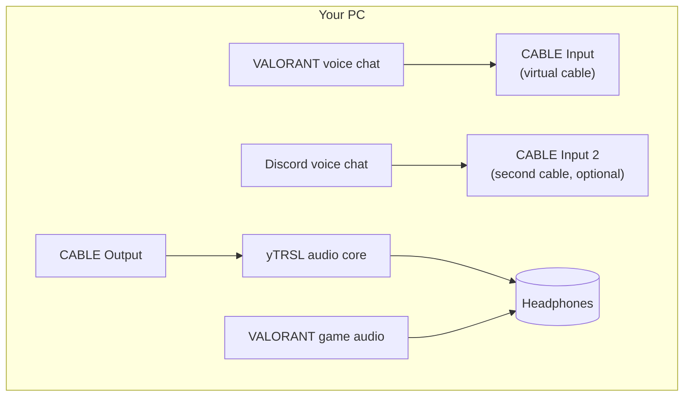

# 17 — Setup Guide

yTRSL turns live VALORANT voice chat into English subtitles. It runs fully
local: your audio never leaves your machine.

## Requirements

- Windows 11 x64 (Windows 10 x64 is untested but likely works).
- A gaming headset / mic that Windows can see as audio endpoints.
- About 4–6 GB free disk for the recommended model set.
- Recommended for clean game-audio capture: **VB-CABLE Virtual Audio Cable**
  (a **separate** install — this guide walks you through it end to end).

---

## Part 1 — Install yTRSL and models

1. Install yTRSL (from the GitHub Releases installer). Launch it.
2. On first run, the **Welcome** dialog lists the models you can download.
   Pick the recommended pair: **Whisper Turbo** (speech recognition) and
   **NLLB** (translation). Downloads are pinned, checksum-verified, and happen
   only when you choose them.
3. Open **Sources** — the VB-CABLE card at the top tells you whether the
   cable was detected, and each source's **Voice input** picker covers both
   microphones and loopback endpoints (see Part 3):
   - **VB-CABLE routing** — the recommended setup: route the voice chat
     through the virtual cable so only the game/party voice is captured.
   - **Direct/loopback** — pick the exact capture and monitoring endpoints
     yourself instead.

---

## Part 2 — Install VB-CABLE

yTRSL does **not** bundle VB-CABLE. It is a free virtual audio driver by
VB-Audio Software — you install it once yourself.

1. Download from <https://vb-audio.com/Cable/> (**Cable V1** is free; the paid
   multi-cable product gives you several independent cables).
2. Run the installer (it adds a Windows audio device pair: **CABLE Input** and
   **CABLE Output**).
3. Reboot or restart the Windows audio service if the devices do not appear
   in Sound settings right away.
4. Verify: Windows **Sound → Playback** shows **CABLE Input**, and
   **Sound → Recording** shows **CABLE Output**.
5. Restart yTRSL and reopen **Sources** — the VB-CABLE card auto-detects
   the cable.

> **Why the cable?** VB-CABLE is a "software wire". Whatever a game or voice
> app plays to **CABLE Input** can be captured from **CABLE Output**. That lets
> yTRSL hear *only* the voice-chat mix instead of the whole game sound.

### The routing, in one picture

---

## Part 3 — Route VALORANT, Discord, and your headphones

The goal: **voice chat goes into the cable** (so yTRSL can read it), **game
sounds stay on your headphones** (so the cable stays clean), and **yTRSL
replays the voice** to your headphones so you still hear your team.

### 3.1 VALORANT voice chat → CABLE Input

In VALORANT **Settings → Audio → Voice Chat**:

1. Set **Output Device** to **CABLE Input**.
2. Keep **Input Device** as your microphone.

Now your teammates' voices play into the cable — and nowhere else.

> Menus change between patches. If you don't see an "output device" for voice
> chat, set VALORANT's **Audio → Output Device** (the whole game) to your
> **headphones**, and only the voice-chat output to the cable when the option
> exists. The key rule: **cable carries voices, headphones carry game sound.**

### 3.2 VALORANT game audio → headphones

In VALORANT **Settings → Audio**:

1. Set **Speaker / Output Device** to your **headphones** (or the device your
   headset uses).
2. Leave game sounds (music, effects) here. They should **never** go to the
   cable — otherwise yTRSL hears explosions and calls them speech.

### 3.3 (Optional) Discord voice → a second cable for a `[DISCORD]` lane

To subtitle Discord as its **own** source (e.g. a separate `[DISCORD]` lane),
use a second virtual cable (the paid VB-CABLE product or a second instance):

1. In **Discord → User Settings → Voice & Video**:
   - **Output Device** → **CABLE Input 2**.
   - **Input Device** → your microphone.
2. In yTRSL **Sources**, add a second source and capture **CABLE Output 2**.

> No second cable? No problem — route Discord and VALORANT into the **same**
> cable and both appear as one source. Two cables just give you per-app lanes.

### 3.4 Headphones — hearing your team (monitoring)

Because voice chat now plays into the cable (not your headset), yTRSL must
**monitor** it back to you:

1. In yTRSL **Sources**, open the source's **Audio source** section and set
   the **headphone output** to your headphones.
2. Turn on **monitoring** for the source.
3. Adjust the monitor **blend** (default 50%). The app echoes the captured
   voice through the headphones so you keep hearing teammates.

> Avoid echo: the monitoring output must be **different** from the capture
> device, and don't also route the same voice into your headphones from the
> game/Discord side — let yTRSL be the single monitor path.

### 3.5 Sanity check

Open **Diagnostics → Isolation check** and run it. It confirms no
cross-source leakage: when only game sounds play and nobody is speaking, the
voice capture meter should stay near-silent. If it jumps, the wrong endpoint
is selected or the game is routing all audio into the cable.

---

## Part 4 — Sources, profiles, and overlay

1. In **Sources**, add each voice channel (`TEAM`, `DISCORD`) and pick its
   **language profile** and **strictness**.
2. Set a **label style** (e.g. `[TEAM]`) — tags render as data, never HTML.
3. In **Overlay** settings, choose the **simultaneous policy** (show both
   lanes, newest wins, or primary wins) and hide any source you don't want.
4. Verify: the overlay shows `[TEAM]` and `[DISCORD]` captions independently.

---

## Troubleshooting

| Symptom | Fix |
|---------|-----|
| No captions, session stuck "listening" | Capture endpoint wrong — re-pick **CABLE Output** in the source's Voice input selector |
| Game sounds appear as speech | Game audio is leaking into the cable — set game output to headphones |
| No voice heard in headphones | Enable monitoring and set monitor output to headphones (Part 3.4) |
| Voice sounds doubled/echoed | Same voice routed twice — let yTRSL be the only monitor path |
| VB-CABLE not detected | Reinstall the driver, reboot, then reopen Sources and check the VB-CABLE card |

---

## Part 5 — History, your voice, and chat

The **History** page is a chat room for your session's transcript.

1. **Per-caption bubbles** — every finalized caption is its own bubble (sized
   to its text, no speaker/avatar inside), with a copy button beside it.
   Right-aligned "You" bubbles (your voice + chat) use a solid color you can
   change in the History settings menu.
2. **Session sidebar** — click the session button in the toolbar to open a
   left column of all sessions (newest on top); click one to view it.
3. **Your voice** — pick a microphone and language pair in the config dialog
   (the mic toggle next to the chat box). While a live session runs, tap the
   mic to translate your own speech in the reverse direction; tap again to
   stop. The mic only captures while the toggle is on.
4. **Typed chat** — type a message in your language and press Enter. It is
   translated on demand (works even without a live session) into a "You"
   bubble you can copy.
5. **Separated live** — inside the config dialog, Start runs a second,
   independent live session of your voice with its own models (sharing the
   loaded model cache); Stop ends it.
6. **Overlay history** — the overlay's history view shows the same transcript,
   pinned to the bottom; "You" entries are right-aligned.

---

## Troubleshooting

| Symptom | Fix |
|---------|-----|
| No captions, session stuck "listening" | Capture endpoint wrong — re-pick **CABLE Output** in the source's Voice input selector |
| Game sounds appear as speech | Game audio is leaking into the cable — set game output to headphones |
| No voice heard in headphones | Enable monitoring and set monitor output to headphones (Part 3.4) |
| Voice sounds doubled/echoed | Same voice routed twice — let yTRSL be the only monitor path |
| VB-CABLE not detected | Reinstall the driver, reboot, then reopen Sources and check the VB-CABLE card |
| Mic toggle does nothing | Pick a microphone in the History config dialog first (a live session must be running) |
| Chat bubble doesn't appear | The chat session opens on the first message — send again or check the session sidebar |
